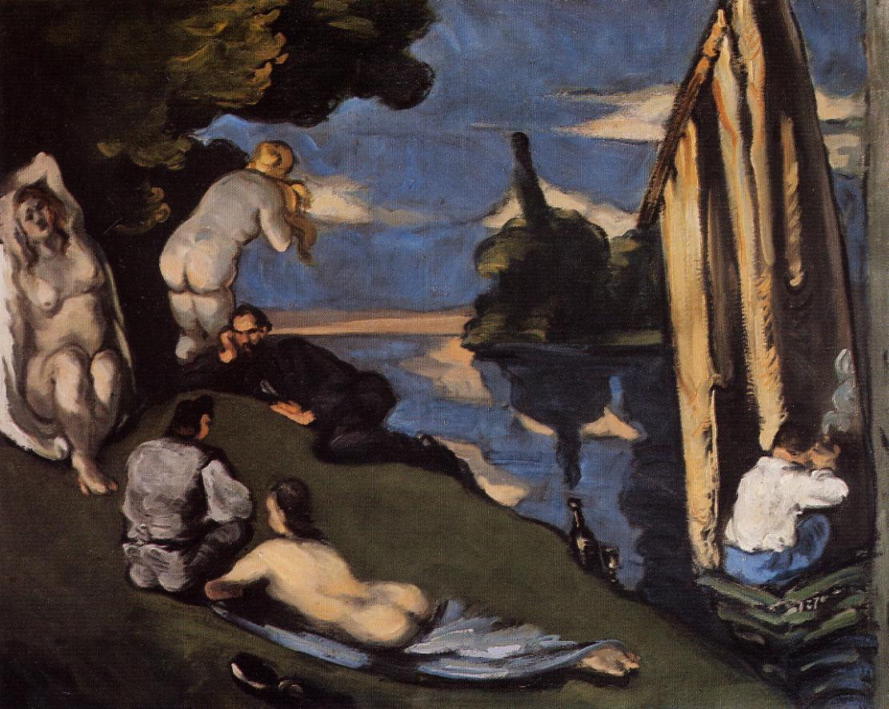

> 与 [[草地上的午餐 The Luncheon on the Grass]]（[[马奈 Édouard Manet]] 1863 版）同名不同作。本页是 [[塞尚 Paul Cézanne]] 1869 年的同名作品——属塞尚早期对马奈构图的"反向消化"。

## 基本信息

- 作者：[[塞尚 Paul Cézanne]]
- 创作年代：1869
- 材质：油彩，画布 (*not from wiki*)
- 尺寸：(*not from wiki*) 约 60 × 81 cm（小型版本）
- 现存地：(*not from wiki*) 私人收藏 / 巴黎橘园美术馆

## 画面与技法

塞尚的"草地上的午餐"是对 [[马奈 Édouard Manet]] 1863 同名画作的回应。顾衡 052 将其放在 **"塞尚的艺术创作之路是从模仿 [[居斯塔夫·库尔贝 Gustave Courbet]] 开始的、用色刀厚涂颜料"** 段落中作为视觉证据。

塞尚此期的几个典型特征（052 顾衡）：

1. **厚涂颜料 + 阔大笔触**——从库尔贝学来但"做得非常过分"。
2. **未完成性当作特点**——库尔贝的阔大笔触为效果服务；塞尚则把"出于内心愤懑 + 技术笨拙"产生的 [[未完成性 Non-finito]] 当成自身特征。
3. **"画我所想"而非"画我所见"**——塞尚一开始就对客观再现不感兴趣，这是他**与印象派最大的差别**。

## 历史背景 (*not from wiki*)

塞尚 1863 年曾与 [[左拉 Émile Zola]] 同去 [[落选者沙龙 Salon des Refusés]]，对马奈那幅引发巨大争议的《草地上的午餐》评价是"色调的关系有着非常细腻的正确性"——这是塞尚 **"对绘画的叙事性主题完全不在意"** 的最早记录（052）。六年后他做出自己版本的"草地上的午餐"，可看作此评价的实操延续。

## 图片清单

| 编号 | 出自 | 描述 |
|---|---|---|
| 01 | [[052｜塞尚1：为什么他是西方现代绘画之父？]] | 全图 |

## 出现在

- [[052｜塞尚1：为什么他是西方现代绘画之父？]]
