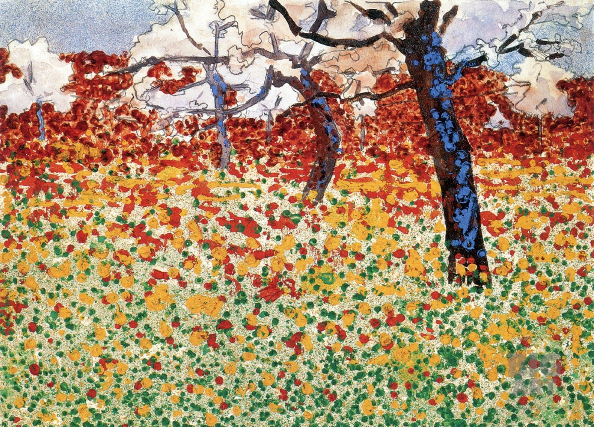

## 基本信息

- 作者：[[席勒 Egon Schiele]]
- 创作年代：1910
- 材质：（*not from wiki*）板上油画
- 尺寸：（*not from wiki*）暂缺
- 现存地：（*not from wiki*）暂缺

## 画面与技法

顾衡 074 定性：**[[新印象主义 Neo-Impressionism]] 风格**——点彩 / 分色块的练习。是席勒同年（1910）人物画转向"残缺母题"前，**风景画方向上对法国新潮流的吸收**。

## 历史背景 (*not from wiki*)

- 1910 也是席勒《[[轻蔑的女人 The Scornful Woman]]》《[[自画像 (席勒 1910) Self Portrait (Schiele)]]》《[[赤裸的自画像 (席勒 1910) Self Portrait Nude (Schiele)]]》的同一年——风格成形的关键节点

## 图片清单

| 编号 | 出自 | 描述 |
|---|---|---|
| 01 | [[074｜席勒1：他为什么走向表现主义？]] | 全图 |

## 出现在

- [[074｜席勒1：他为什么走向表现主义？]]
