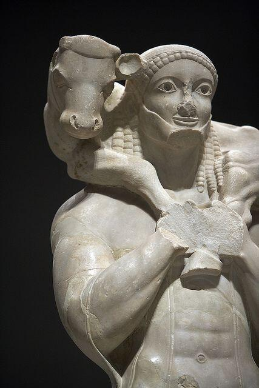

## 基本信息
- 作者：匿名
- 创作年代：约公元前 570 年
- 材质：大理石
- 现存地：雅典卫城博物馆 (*not from wiki*)

## 画面与技法
- 男子肩扛小牛犊作献神祭祀状
- **标志性意义**：通过"扛着祭品"的情节让赞助人在程式化的库罗斯像中获得可识别身份 → 古希腊古风期个性化的早期尝试
- 整体造型仍处于 [[古希腊古风时期 Greek Archaic Period]] 的程式中（正面像、立柱式站姿）

## 历史背景 (*not from wiki*)
1864 年发现于雅典卫城，是雅典前古典时期献神雕像的重要代表之一。

## 图片清单

| 编号 | 出自 | 描述 |
|---|---|---|
| 01 | [[002｜古希腊雕塑：为什么做得这么逼真？]] | 大理石全身像 |

<!-- src: https://piccdn3.umiwi.com/img/202103/10/202103101343112011392985.jpg -->

## 出现在
- [[002｜古希腊雕塑：为什么做得这么逼真？]]
