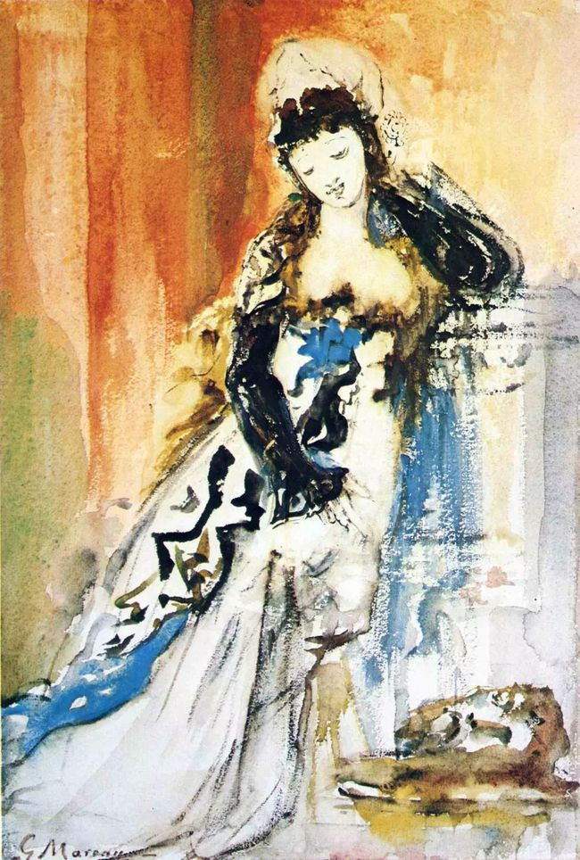

## 基本信息

- 作者：[[莫罗 Gustave Moreau]]
- 创作年代：1875 (*from this source*)
- 材质：油彩 / 画布 (*not from wiki*)
- 尺寸：年代不详
- 现存地：(*not from wiki*) 私人收藏 / 莫罗博物馆 Musée Gustave Moreau, Paris (待确认)

## 画面与技法

莫罗一生反复绘制 [[莎乐美 Salome]] 题材，本作为 1875 年单人立像版本——与 1876《[[在希律王前舞蹈的莎乐美 Salome Dancing before Herod]]》和 1874–1876《[[显灵 The Apparition]]》共同构成莫罗"**女人是老虎**"母题最核心的三联——区别在于：1875 版以**孤身正面**的莎乐美形象出现，**装饰性凝练到极致**，可视为莫罗对该形象的"母题原型"提炼。

## 历史背景

(*not from wiki*) 莫罗自 1870 年代起反复回到莎乐美主题，共创作数十幅相关画作（含水彩、油彩、素描）；这些画与 [[于斯曼 Joris-Karl Huysmans]] 1884《[[逆流 À rebours]]》、1891 王尔德戏剧《莎乐美》、1905 理查·斯特劳斯歌剧《莎乐美》共同构成 19 世纪末**世纪末（fin de siècle）颓废派对致命女性（femme fatale）想象**的母题谱系。

## 图片清单

| 编号 | 出自 | 描述 |
|---|---|---|
| 01 | [[050｜莫罗：象征主义绘画为什么走向朦胧？]] | 1875 全图——单人莎乐美 |

## 出现在

- [[050｜莫罗：象征主义绘画为什么走向朦胧？]]
