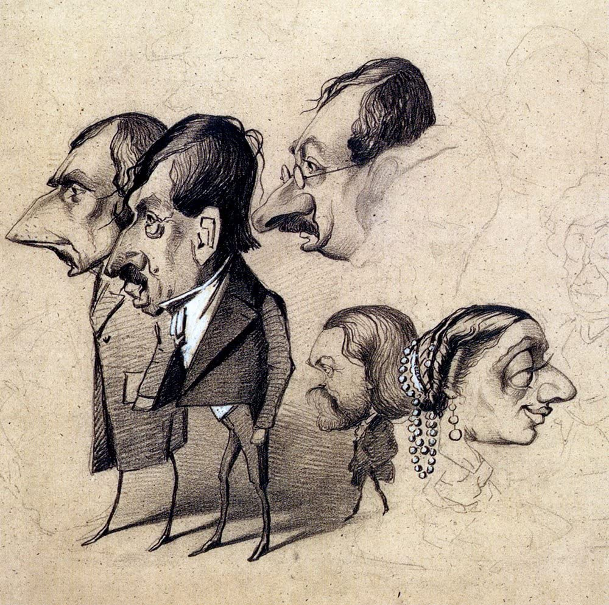

## 基本信息

- 作者：[[莫奈 Claude Monet]]
- 创作年代：约 1855–1858（莫奈 15 岁前后；041 caption 无具体年份）(*not from wiki*)
- 材质：纸本铅笔 / 炭笔 / 水彩 (*not from wiki*)
- 尺寸：单幅小尺寸 (*not from wiki*)
- 现存地：分散于各馆 (*not from wiki*) —— 一部分藏于巴黎玛蒙丹莫奈博物馆 Musée Marmottan Monet

## 画面与技法

莫奈 15 岁起在勒阿弗尔卖给街坊邻居的**人物漫画**——每幅索价 **20 法郎**——041 顾衡："**他画的人物漫画实在是太像了，大家一眼就能认出他画的是谁。**" 这批漫画挂在画框店橱窗里招揽生意。

041 的论述功能：这批漫画 = 莫奈"**漫画式准确把握人物特征**"能力的源头——后来在 [[格莱尔 Charles Gleyre]] 画室竟然**反过来成了被批评的"缺点"**："**你把人物画得太像啦！……风格高于一切！**"

041 把"15 岁漫画神童 → 22 岁巴黎画室被骂'画得太像'"作为**学院派 vs 莫奈的方法论根本冲突**的视觉证据。

## 历史背景

041 给出的传记节点：
1. 1840 生于巴黎 → 5 岁迁勒阿弗尔。
2. 15 岁因漫画成为勒阿弗尔城市名人；每幅 20 法郎；钱寄给姑姑代攒（不让爹妈截胡）。
3. 卖漫画结识画框店老板 [[布丹 Eugène Boudin]]——是莫奈"了解外面世界的重要窗口"，并接到了"画出眼睛即时看见的东西"的关键教导。
4. 漫画攒下来的钱后来花完了——这是莫奈早期模仿 [[柯罗 Camille Corot]]、急于获沙龙承认的经济动因。

## 图片清单

| 编号 | 出自 | 描述 |
|---|---|---|
| 01 | [[041｜莫奈1：颠覆式的创新从何而来？]] | 莫奈早期人物漫画样张（无具体作品名） |

## 出现在

- [[041｜莫奈1：颠覆式的创新从何而来？]]
