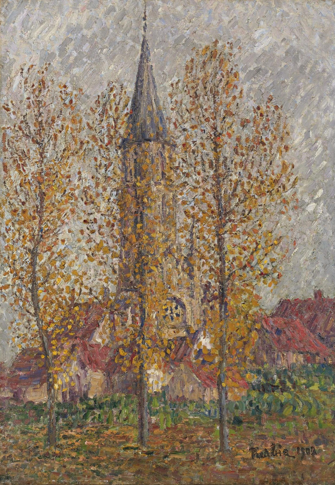

## 基本信息

- 作者：[[毕卡比亚 Francis Picabia]]
- 创作年代：1902
- 材质：布面油画 (*not from wiki*)
- 尺寸：年代不详 (*not from wiki*)
- 现存地：私人收藏 (*not from wiki*)

## 画面与技法

顾衡用此画论证[[毕卡比亚 Francis Picabia]] "**不拘泥于哪一个流派的理论**"——总的看是 [[新印象主义 Neo-Impressionism]] 的画法。按说"通篇都要画同样大小的纯色小点点"，但毕卡比亚**很随性**：前景的树叶该画小点点的地方就画小点点，背景的房子该画色块就画色块——**避免了新印象主义的造型呆板和色彩偏淡的问题**，所以这个时期的作品大受欢迎。

## 历史背景

(*not from wiki*) 1902 年作品；新印象主义此时已被 [[修拉 Georges Seurat]] 死后由 [[西涅克 Paul Signac]] 推广开来，但严格的 [[点彩 Pointillism]] 受到很多画家的私下不满。毕卡比亚的"随性混搭"成了一种解决方案。

## 图片清单

| 编号 | 出自 | 描述 |
|---|---|---|
| 01 | [[091｜毕卡比亚：如何用绘画表现达达主义？]] | 整体图 — 前景点彩 + 背景色块的混搭 |

## 出现在

- [[091｜毕卡比亚：如何用绘画表现达达主义？]]
