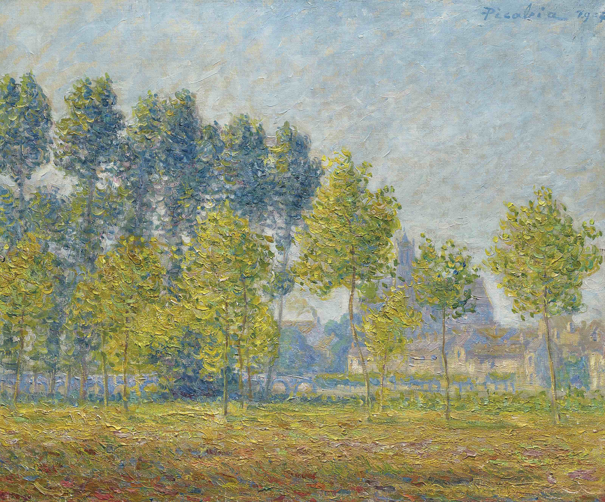

## 基本信息

- 作者：[[毕卡比亚 Francis Picabia]]
- 创作年代：1904
- 材质：布面油画 (*not from wiki*)
- 尺寸：年代不详 (*not from wiki*)
- 现存地：私人收藏 (*not from wiki*)

## 画面与技法

[[毕卡比亚 Francis Picabia]] 印象派出道期作品——莫雷是巴黎东南部小镇，[[印象派 Impressionism]] 画家 [[西斯莱 Alfred Sisley]] (*not from wiki*) 晚年居住地。"忠实致敬 [[莫奈 Claude Monet]]"系列之一。

## 历史背景

(*not from wiki*) 1904 年前后，毕卡比亚以印象派风格大受欢迎。

## 图片清单

| 编号 | 出自 | 描述 |
|---|---|---|
| 01 | [[091｜毕卡比亚：如何用绘画表现达达主义？]] | 整体图 — 莫雷河岸杨树 |

## 出现在

- [[091｜毕卡比亚：如何用绘画表现达达主义？]]
