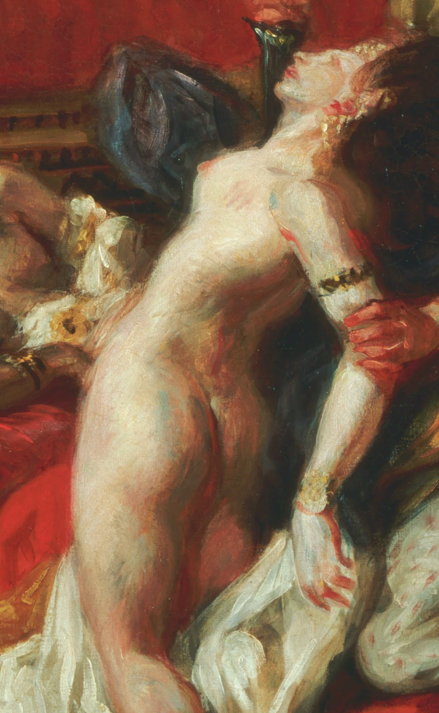
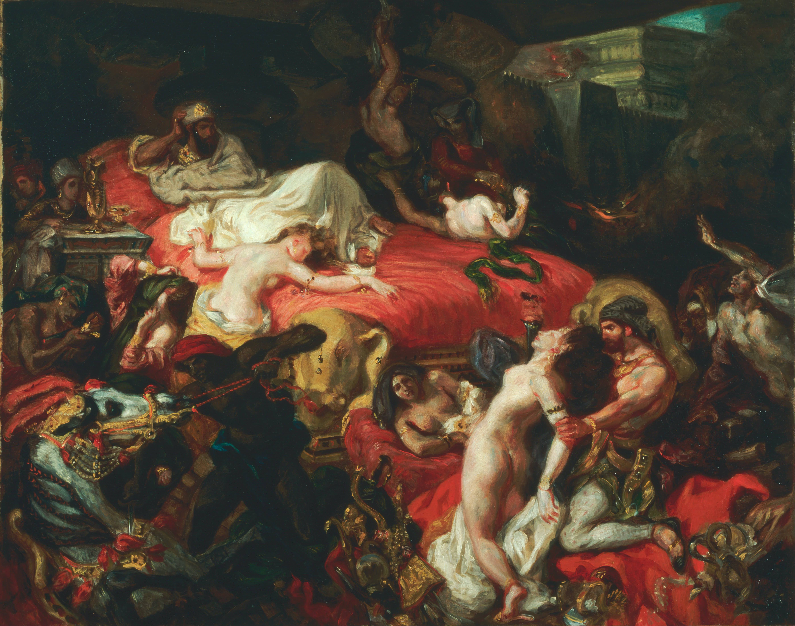

## 基本信息

- 作者：[[德拉克罗瓦 Eugène Delacroix]]
- 创作年代：1827
- 材质：布面油画 (*not from wiki*)
- 尺寸：392 × 496 cm (*not from wiki*)
- 现存地：(*not from wiki*) 巴黎卢浮宫

## 画面与技法

题材取自 [[拜伦 Lord Byron]] 同名诗剧 (*not from wiki*)——亚述末代君主**萨尔丹纳帕拉**兵败前在尼尼微宫殿中下令焚毁一切珍宝、屠杀宠妃爱马、然后自焚。画面右上方斜倚的国王面无表情，金红色卧榻沿对角线倾斜冲入画面下方——杀戮、嘶吼的马、扑跌的裸女、火光、珠宝、鲜血与黄金混作一团。

**色彩派的极致样本**：顾衡 034 把本画前景"身体呈弓型的裸女"作为**[[谢弗勒尔 Michel Eugène Chevreul]] 补色原理在油画中落地**的关键样本——画家**不再先打底子再罩染**，而是"**把画笔当作织布的梭子**，让各种颜色像经纬线一样到处互相交织和彼此打断"（德拉克罗瓦徒弟原话）。裸女的左手不再有清晰边线，**平行排列、彼此分离的笔触**让相邻冷暖色互相增强——红更红、绿更绿。这一步**实在超出了 [[安格尔 Jean-Auguste-Dominique Ingres]] 所能容忍的底线**——线条 vs 色彩之争从此**不再是学院派内部矛盾**。

与 [[鲁本斯 Peter Paul Rubens]] 的 [[劫夺留西帕斯的女儿 The Rape of the Daughters of Leucippus]] 对照——后者**打底 + 罩染**塑形，前者**笔触并置**塑形：相同的"色彩派"血统、不同时代的技术取向。

## 历史背景

(*not from wiki*) 1827 年沙龙首展即引发激烈争议——题材的**异国情调、暴力色情、构图的对角线倾斜**全部冲击学院派规范；官方艺术总监甚至以撤销订单威胁德拉克罗瓦不再画类似主题。但本作日后被公认为德拉克罗瓦**浪漫主义高峰**的标志作之一——情感强度、构图动荡、色彩主导，几乎触遍 [[浪漫主义 Romanticism]] 全部要点。

## 在课程中的角色

顾衡 034 把本画作为**德拉克罗瓦技法颠覆学院派的核心证据**：
- 第一次出现于"他留下的著名作品还有很多"，作为承接 [[自由领导人民 Liberty Leading the People]] 之后的德拉克罗瓦代表作；
- 第二次出现于与 [[劫夺留西帕斯的女儿 The Rape of the Daughters of Leucippus]] 并置——展示**德拉克罗瓦如何在鲁本斯的色彩派传统上再走一步**；
- 第三次（局部特写）出现于"前景弓型裸女的左手"——展示**笔触并置 + 补色原理**的可见痕迹。

## 图片清单

| 编号 | 出自 | 描述 |
|---|---|---|
| 01 | [[034｜德拉克罗瓦：为什么他成了浪漫主义的旗手？]] | 全画（在 034 中三次出现，原文两幅全画 URL 不同但图像同一；按 dedup 规则复用） |
| 02 | [[034｜德拉克罗瓦：为什么他成了浪漫主义的旗手？]] | 前景弓型裸女左手局部——笔触并置塑形 |

## 出现在

- [[034｜德拉克罗瓦：为什么他成了浪漫主义的旗手？]] —— 德拉克罗瓦技法颠覆学院派的核心证据
