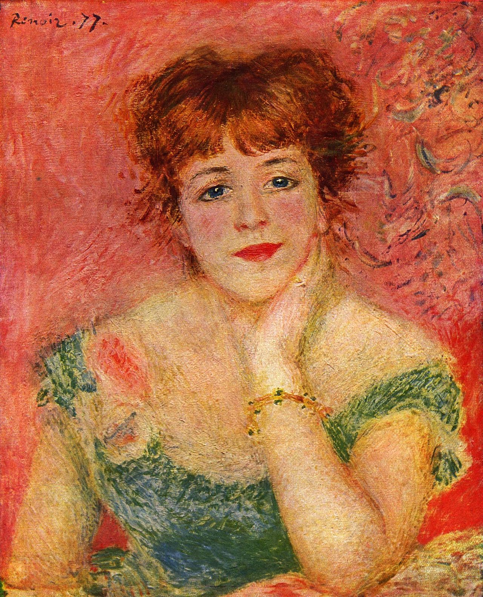

## 基本信息

- 作者：[[雷诺阿 Pierre-Auguste Renoir]]
- 创作年代：1877
- 材质：布面油画 (*not from wiki*)
- 尺寸：56 × 47 cm (*not from wiki*)
- 现存地：普希金博物馆 Pushkin Museum, Moscow (*not from wiki*)

## 画面与技法

043 顾衡用本作展示**雷诺阿对印象派短板的弥补**："**人物的五官表现得非常精致，而印象派特有的小笔触所营造出的光与色的颤动，又让画面显得非常生动。**"——这是雷诺阿"凡事求中庸"性格在画面上的直接对应：

- **传统**：精致五官、清晰人脸（不被光线碎块吞没）；
- **印象派**：背景与衣物用细碎小笔触表现光与色的颤动。

顾衡在 043 中借此作出关键判语——"**雷诺阿在风格的多样和技法的细腻上，弥补了莫奈过度追求光线效果而导致的形状崩溃**"。

## 历史背景 (*not from wiki*)

让娜·萨玛丽 (1857–1890) 是法兰西喜剧院当红女演员，雷诺阿在 1877–1878 年间为她画了多幅肖像，本作是最早一幅。模特的丈夫姓名"萨玛丽"被译入中文标题，但模特本人未婚——这是中译惯例造成的小偏差。

## 图片清单

| 编号 | 出自 | 描述 |
|---|---|---|
| 01 | [[043｜雷诺阿：妥协如何造就大师？]] | 全图，半身肖像 |

## 出现在

- [[043｜雷诺阿：妥协如何造就大师？]]
