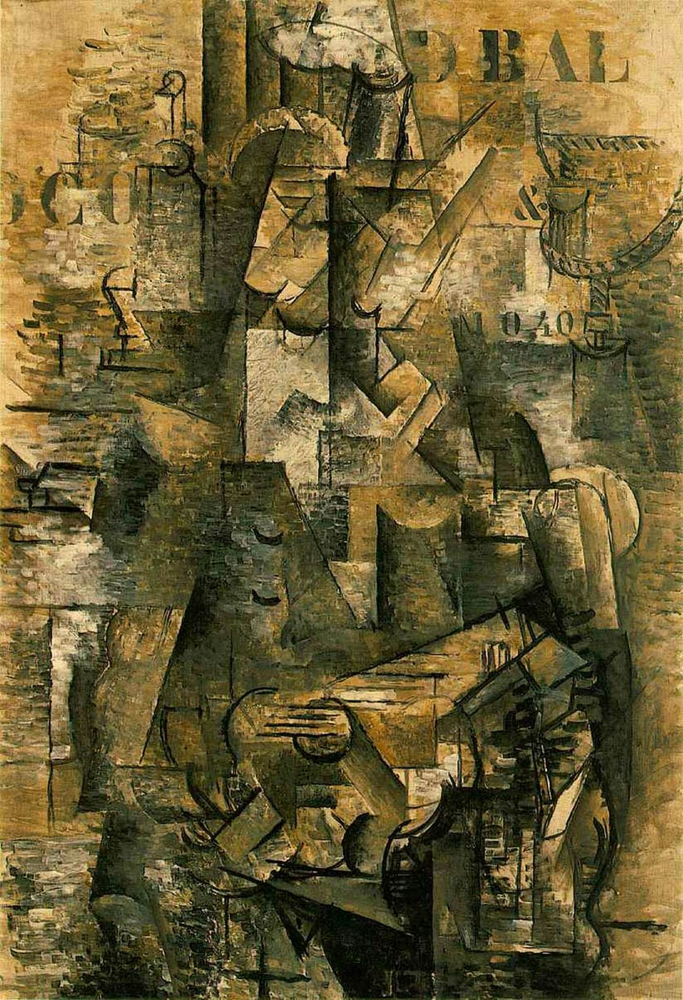

## 基本信息

- 作者：[[勃拉克 Georges Braque]]
- 创作年代：1911
- 材质：布面油画 (*not from wiki*)
- 尺寸：117 × 81 cm (*not from wiki*)
- 现存地：巴塞尔美术馆 (Kunstmuseum Basel) (*not from wiki*)

## 画面与技法

**分析立体主义 (Analytical Cubism)** 的标志性作品之一。画面是一个抱着吉他坐在酒吧里的葡萄牙水手；但整个形体已经被**击碎**为大量灰褐色的几何切面，几乎无法辨认出具体造型。

最革命性的细节：**画面右上首次出现印刷字母与数字** (`D BAL`、`10.40`)——这是**整个西方绘画史上第一次**把字符、印刷符号直接搬进油画。顾衡指出：这一**首创也是勃拉克的发明**，毕加索是跟进者。

## 历史背景 (*not from wiki*)

被视为**分析立体主义最纯粹的代表作之一**，也是 collage 与 typography 进入现代绘画的先驱事件。

## 图片清单

| 编号 | 出自 | 描述 |
|---|---|---|
| 01 | [[068｜立体主义，除了毕加索还值得了解什么？]] | 分析立体主义代表作；首次在油画中加入字母与数字 |

## 出现在

- [[068｜立体主义，除了毕加索还值得了解什么？]] —— "在油画中加入字母数字" 的首创
