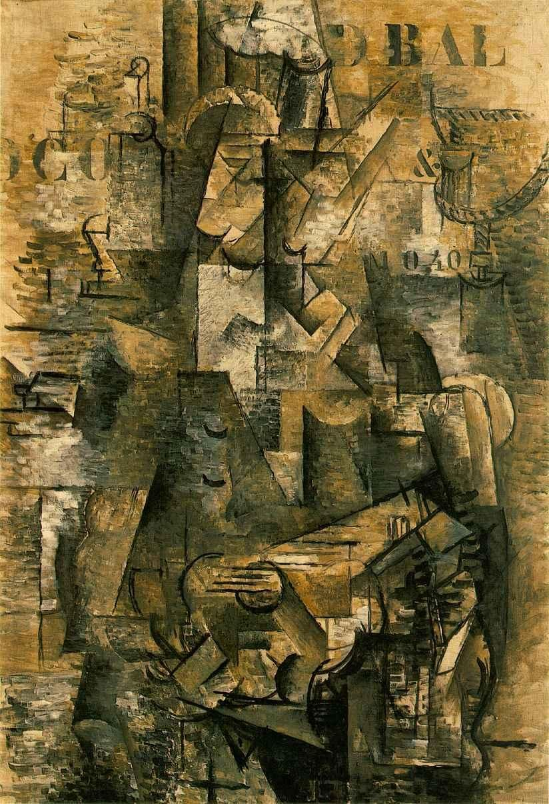

## 基本信息

- 作者：[[勃拉克 Georges Braque]]
- 创作年代：1911
- 材质：布面油画 (*not from wiki*)
- 尺寸：117 × 81.5 cm (*not from wiki*)
- 现存地：巴塞尔美术馆 Kunstmuseum Basel (*not from wiki*)

## 画面与技法

[[勃拉克 Georges Braque]] [[分析立体主义 Analytical Cubism]] 高峰期最重要的作品之一——

- 顾衡（066）以本作举证：分析立体主义阶段毕加索与勃拉克的作品**互不署名、风格几乎不可分辨**——"都是些小三角小圆圈，有啥区别呢？"
- 画面用褐 / 灰 / 土黄的几何切面拼接出一个吧台里的男子形象，**首次在画面上引入印刷字体的字母与数字**（"D BAL"、"10,40" 等）——这一手法直接预示了 [[综合立体主义 Synthetic Cubism]] 阶段对印刷文字、拼贴的全面拥抱 (*not from wiki*)。
- 与毕加索的《[[卡恩韦勒肖像 Portrait of Daniel-Henry Kahnweiler]]》、《[[钢琴和手风琴家 The Piano Accordionist]]》、《[[我的美人（女吉他手）My Beauty (Woman with Guitar)]]》同列。

## 历史背景 (*not from wiki*)

- 画中人为勃拉克在马赛港吧台所见的一位葡萄牙裔水手 / 移民。
- 1911 年勃拉克与毕加索在 Céret（法国南部）同地作画，分析立体主义至此达到合作最紧密、风格最接近的高峰；本作正是这一年的产物。
- 把字母印刷字体引入画面，是勃拉克的发明 (*not from wiki*)——他早年学装饰画家、熟悉印刷字体，本作中"D BAL"等字母通过模板印刷完成。

## 图片清单

| 编号 | 出自 | 描述 |
|---|---|---|
| 01 | [[066｜毕加索3：什么是分析立体主义？]] | 全图——勃拉克分析立体主义高峰；首次引入印刷字母 |

## 出现在

- [[066｜毕加索3：什么是分析立体主义？]] —— 勃拉克在 [[分析立体主义 Analytical Cubism]] 阶段的代表作
