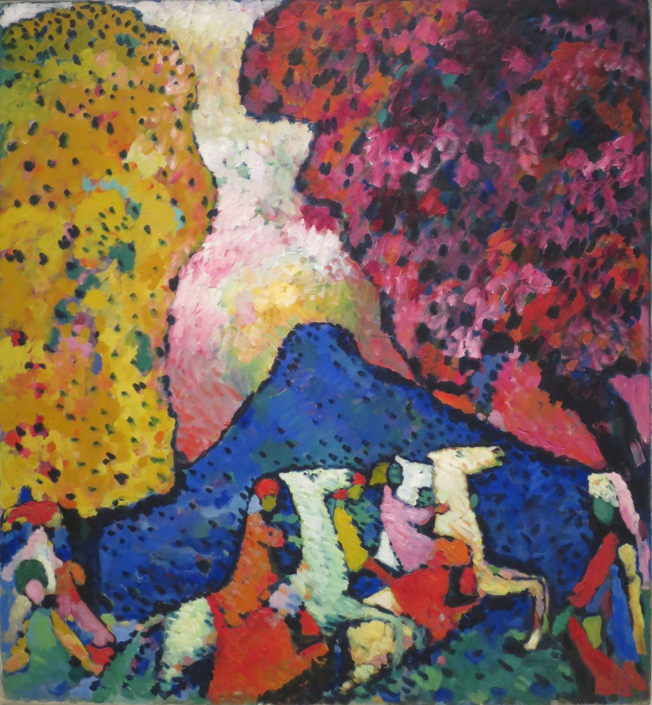

## 基本信息

- 作者：[[康定斯基 Wassily Kandinsky]]
- 创作年代：1908–1909
- 材质：布面油画 (*not from wiki*)
- 尺寸：(*not from wiki*：106 × 96.6 cm)
- 现存地：(*not from wiki*：纽约古根海姆博物馆)

## 画面与技法

- **色彩浓艳而主观**，是典型的 [[野兽派 Fauvism]] 风格
- **空间被极度压缩，几乎成了二维平面**
- 画面中几个骑马人的形象**大胆借鉴了俄罗斯圣像画的特点**——高度程式化的人物形象极大提高了整个画面的装饰性

顾衡评价："可以称得上是一幅杰作。"

## 历史背景 (*not from wiki*)

康定斯基从巴黎时期接受 [[马蒂斯 Henri Matisse]] 影响、回到慕尼黑后的作品。是其从野兽派向 [[抽象绘画 Abstract Painting]] 演变的关键过渡之一。对俄罗斯圣像画的借鉴上，康定斯基与马蒂斯（在 [[格特鲁德·斯坦因 Gertrude Stein]] 沙龙以及为 [[音乐 (马蒂斯) Music (Matisse)]] / [[舞蹈 (马蒂斯) Dance (Matisse)]] 金主史楚金家安装壁画时观赏过俄罗斯圣像画）"英雄所见略同"。

## 图片清单

| 编号 | 出自 | 描述 |
|---|---|---|
| 01 | [[081｜康定斯基1：什么是抽象绘画？]] | 二维平面化空间；山、树、程式化骑马人形象 |

## 出现在

- [[081｜康定斯基1：什么是抽象绘画？]]
