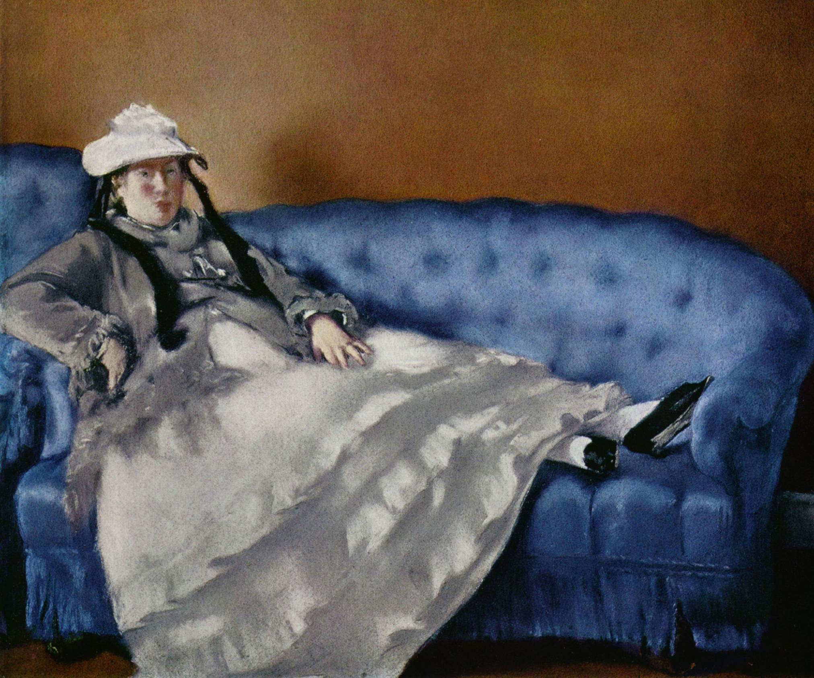

## 基本信息

- 作者：[[马奈 Édouard Manet]]
- 创作年代：1874
- 材质：粉彩，纸 (*not from wiki*)
- 尺寸：65 × 61 cm (*not from wiki*)
- 现存地：奥赛博物馆，巴黎 (*not from wiki*)

## 画面与技法

马奈夫人 Suzanne Leenhoff 的肖像——画中的"马奈夫人"原是马奈父亲雇来教马奈兄弟弹钢琴的荷兰女子，与马奈未婚先孕生子。本课用这幅画引出**马奈的家庭故事与经济困境**：父亲死后母亲掌握财政大权，怀疑孙子是丈夫的私生子，让马奈一辈子大多数时候为钱发愁。

## 历史背景 (*not from wiki*)

- Suzanne Leenhoff 是荷兰人；
- 两人 1863 年结婚（早在结婚前数年已生下一子 Léon Koëlla-Leenhoff，其生父身份至今存疑——可能是马奈，也可能是马奈父亲）；
- 马奈终身画了多幅马奈夫人肖像。

## 图片清单

| 编号 | 出自 | 描述 |
|---|---|---|
| 01 | [[039｜马奈2：画家如何应对照相机的冲击？]] | 全图，蓝沙发上的半身像 |

## 出现在

- [[039｜马奈2：画家如何应对照相机的冲击？]]
