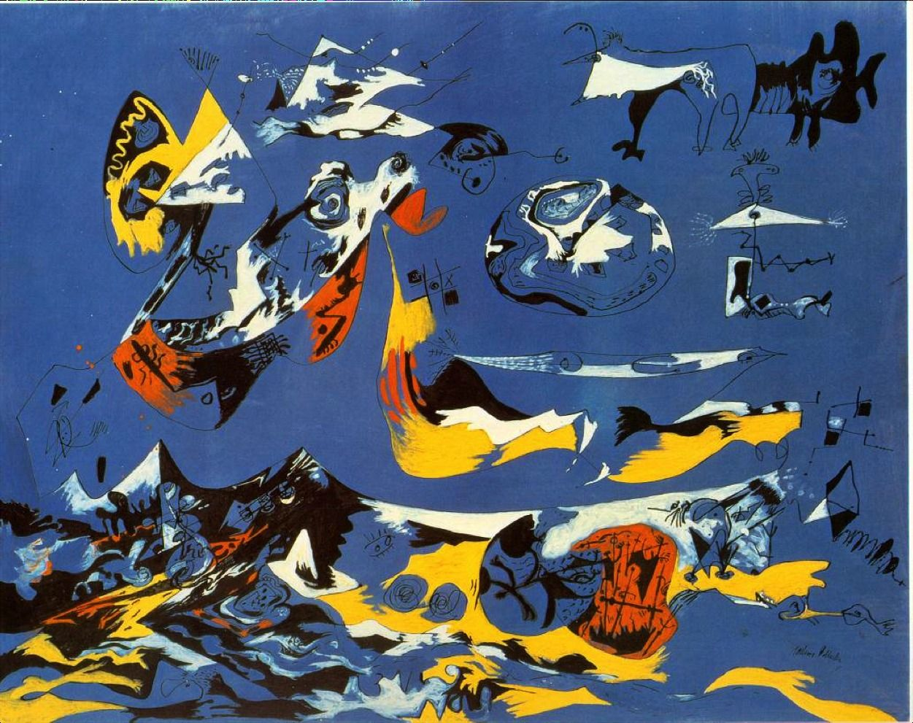

## 基本信息

- 作者：[[波洛克 Jackson Pollock]]
- 创作年代：1943
- 材质：(*not from wiki*)
- 尺寸：(*not from wiki*)
- 现存地：(*not from wiki*)

## 画面与技法

"炒杂碎过渡期"代表作之一——野兽派、抽象、立体主义、表现主义元素混杂，但已经开始向超现实主义梦境绘画偏移。

## 历史背景 (*not from wiki*)

1943 年是波洛克的重大转折年——同年签约 [[佩姬·古根海姆 Peggy Guggenheim]]、画《[[壁画 (波洛克) Mural (Pollock)]]》。标题《白鲸》借用梅尔维尔同名小说。

## 图片清单

| 编号 | 出自 | 描述 |
|---|---|---|
| 01 | [[096｜波洛克：什么是当代艺术的第一个流派？]] | 蓝（白鲸） Blue (Moby Dick) (1943) |

## 出现在

- [[096｜波洛克：什么是当代艺术的第一个流派？]]
