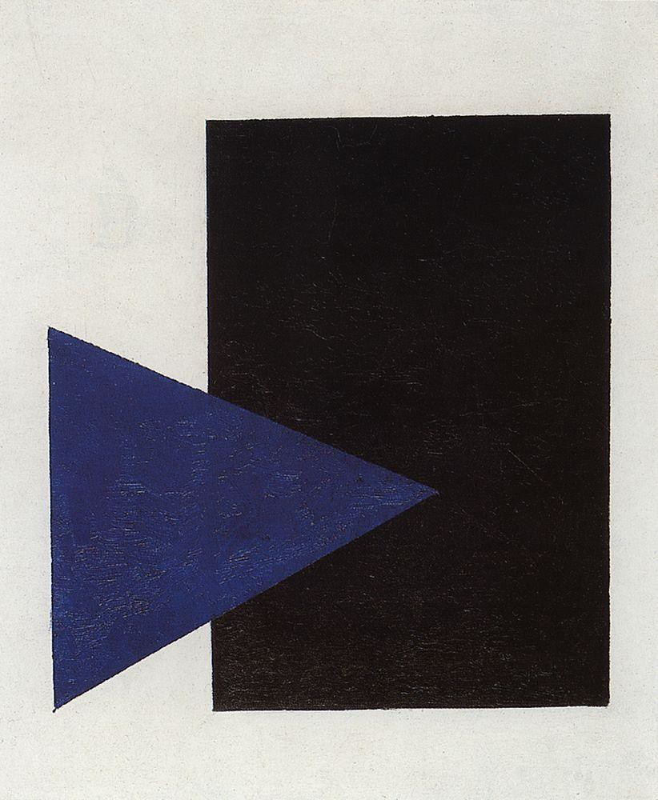

## 基本信息

- 作者：[[马列维奇 Kazimir Malevich]]
- 创作年代：1915
- 材质：布面油画 (*not from wiki*)
- 尺寸：年代不详 (*not from wiki*)
- 现存地：荷兰阿姆斯特丹市立博物馆 (*not from wiki*)

## 画面与技法

[[至上主义 Suprematism]] 彩色阶段的另一样本——白色画布上一个蓝色三角形与一个黑色矩形的几何配置。

## 图片清单

| 编号 | 出自 | 描述 |
|---|---|---|
| 01 | [[083｜马列维奇：什么是至上主义？]] | 全画 |

## 出现在

- [[083｜马列维奇：什么是至上主义？]]
