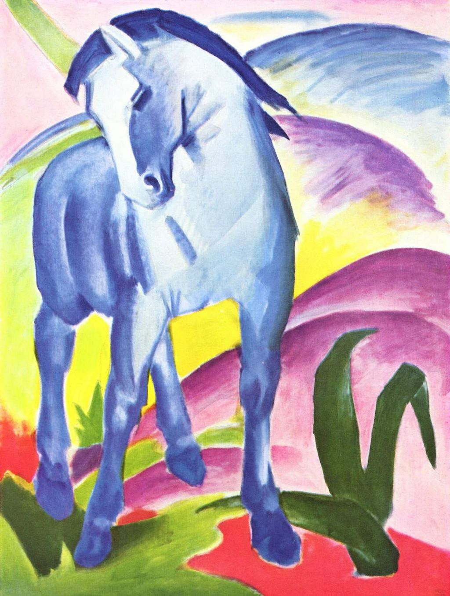

## 基本信息

- 作者：[[马尔克 Franz Marc]]
- 创作年代：1910
- 材质：布面油画 (*not from wiki*)
- 尺寸：(*not from wiki*：112 × 84.5 cm)
- 现存地：(*not from wiki*：慕尼黑 Lenbachhaus 美术馆)

## 画面与技法

一匹蓝马伫立在橙红、绿色调的山丘前。色彩高度象征化（蓝 = 男性 / 精神性，马尔克自创色彩理论 *not from wiki*）。

## 历史背景

马尔克与 [[康定斯基 Wassily Kandinsky]] 都喜欢马也喜欢蓝色，这一共同偏好直接导向 1911 年 [[青骑士 Der Blaue Reiter]] 团体的命名。本作是马尔克"蓝马"主题的代表作之一。

## 图片清单

| 编号 | 出自 | 描述 |
|---|---|---|
| 01 | [[081｜康定斯基1：什么是抽象绘画？]] | 一匹蓝马伫立于山丘前 |

## 出现在

- [[081｜康定斯基1：什么是抽象绘画？]]
