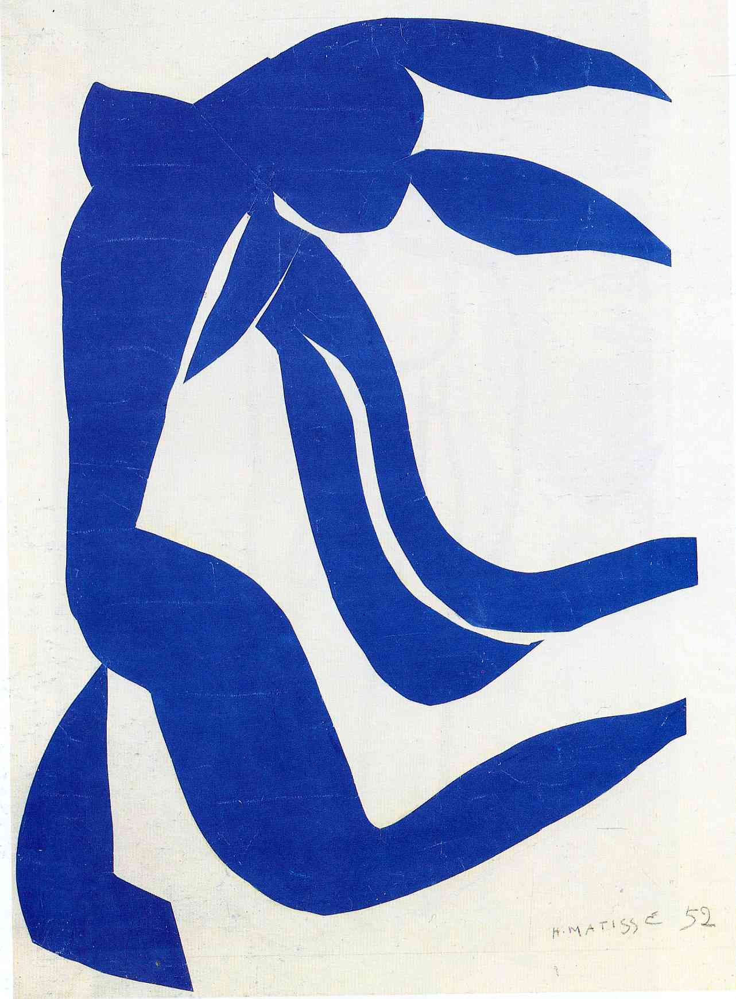
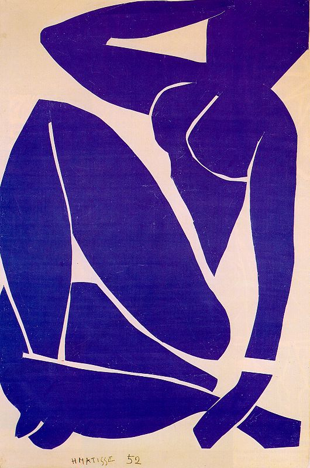

## 基本信息

- 作者：[[马蒂斯 Henri Matisse]]
- 创作年代：1952
- 材质：[[剪纸 Cut-outs]] —— 水粉彩纸剪贴 (*not from wiki*)
- 尺寸：(*not from wiki*)
- 现存地：(*not from wiki* 散藏多馆 / 部分藏 Centre Pompidou)

## 画面与技法

062 援引此系列为 [[马蒂斯 Henri Matisse]] **剪纸最出色的作品**：

- **晚年卧病在床的马蒂斯没法再创作油画**，剪纸成了他**唯一的安慰**
- 这些剪纸作品中最出色的就是《蓝色的裸女》系列
- 因被**法国政府选为邮票发行**，而名声大噪

(*not from wiki*) 系列共四件 (Nu bleu I–IV)，皆以**单一蓝色**剪出折叠坐姿裸女轮廓，肢体被切分为可拼接的色块单元——是马蒂斯"**形状简化到极致再研究它与颜色的关系**"这一终生方法论的最直接物质化兑现。

## 历史背景 *(not from wiki)*

(*not from wiki*) 1952 年创作，离马蒂斯 1954 辞世仅 2 年。此时马蒂斯已长期卧床，剪纸是他**唯一可执行的创作媒介**。系列因被法国政府制成邮票推向公众视野而进入大众文化记忆。

## 图片清单

| 编号 | 出自 | 描述 |
|---|---|---|
| 01 | [[062｜马蒂斯3：如何理解他一生的创作？]] | 蓝色裸女剪纸之一 |
| 02 | [[062｜马蒂斯3：如何理解他一生的创作？]] | 蓝色裸女剪纸之二 |

## 出现在

- [[062｜马蒂斯3：如何理解他一生的创作？]] —— 剪纸最出色的代表系列
