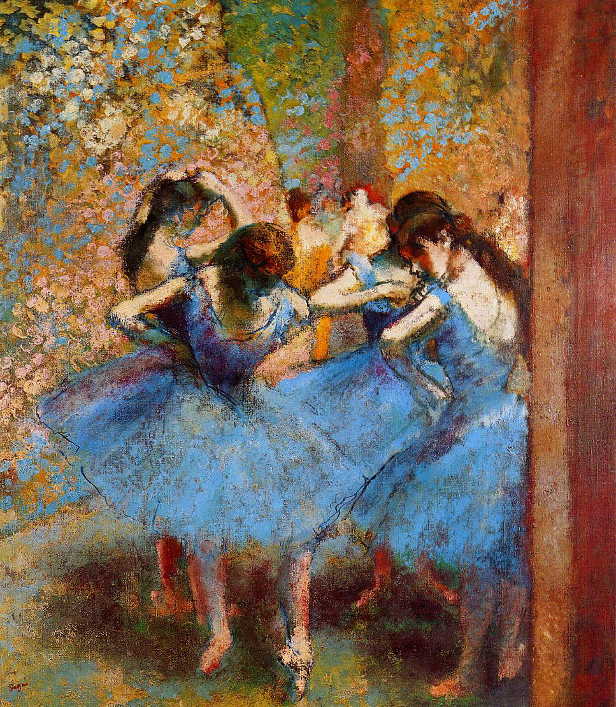

## 基本信息

- 作者：[[德加 Edgar Degas]]
- 创作年代：约 1895
- 材质：布面油画 / 粉彩 (*not from wiki*)
- 尺寸：85 × 75.5 cm (*not from wiki*)
- 现存地：(*not from wiki*) 巴黎奥赛博物馆 Musée d'Orsay

## 画面与技法

德加晚年（视力恶化期）芭蕾舞女系列的代表作之一——**强烈的蓝色基调** + **从上方俯视的视角**——四位舞女在后台调整服装，没有面部表情，纯粹的色块和动态线条 (*not from wiki*)。

045 顾衡指出德加晚年喜爱在浴女与舞女主题中"刻意回避模特的脸"——"因为他不想表现任何个性化的东西，更不想用作品表现情感"。

## 历史背景

(*not from wiki*) 1895 年德加 61 岁——视力严重衰退，转向粉彩与雕塑。

## 图片清单

| 编号 | 出自 | 描述 |
|---|---|---|
| 01 | [[045｜德加：为什么印象派以他结束？]] | 四位蓝衣舞女在后台 |

## 出现在

- [[045｜德加：为什么印象派以他结束？]]
