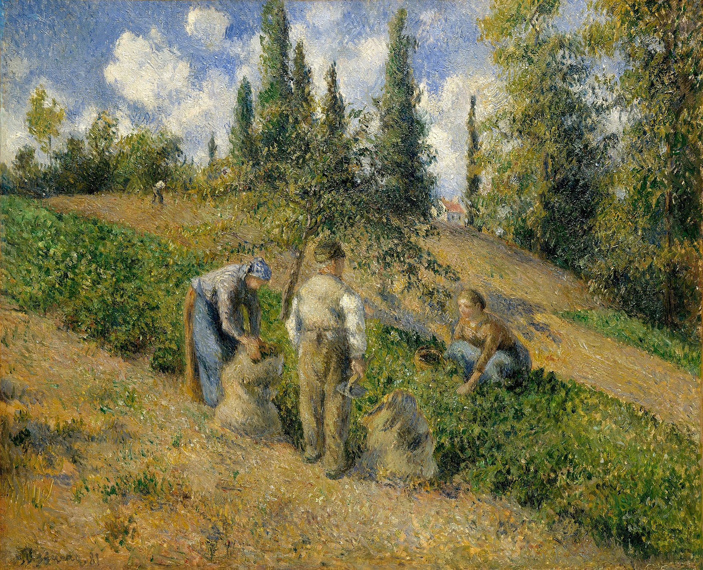

## 基本信息

- 作者：[[毕沙罗 Camille Pissarro]]
- 创作年代：1881
- 材质：(*not from wiki*) 蛋彩 / 油画
- 尺寸：(*not from wiki*) 约 70 × 127 cm（大尺幅）
- 现存地：(*not from wiki*) 东京 Bridgestone 美术馆 / 私人收藏（版本不一）

## 画面与技法

[[毕沙罗 Camille Pissarro]] **1890 前乡居时期**的农村劳作题材代表作——蓬图瓦兹田间正在收割的农民、远处麦垛与丘陵。**色调温和、笔触含蓄**——是毕沙罗"恬淡内敛"风格的另一个样本。

## 在课程中的角色

顾衡 044 把它列入毕沙罗 1890 前隐居时期"画的是农村不起眼的风景"的代表作组——与《[[林中小径 The Woods at Marly]]》《[[蓬图瓦兹附近的小村庄 Hamlet around Pontoise]]》《[[吉索附近的努弗勒圣马丁 Neaufles Saint Martin near Gisors]]》共同呈现毕沙罗的恬淡基调。

## 图片清单

| 编号 | 出自 | 描述 |
|---|---|---|
| 01 | [[044｜莫利索和毕沙罗：最纯正的印象派什么样？]] | 全画 |

## 出现在

- [[044｜莫利索和毕沙罗：最纯正的印象派什么样？]] —— 毕沙罗乡居时期农村劳作题材样本
- [[毕沙罗 Camille Pissarro]] —— 代表作之一
