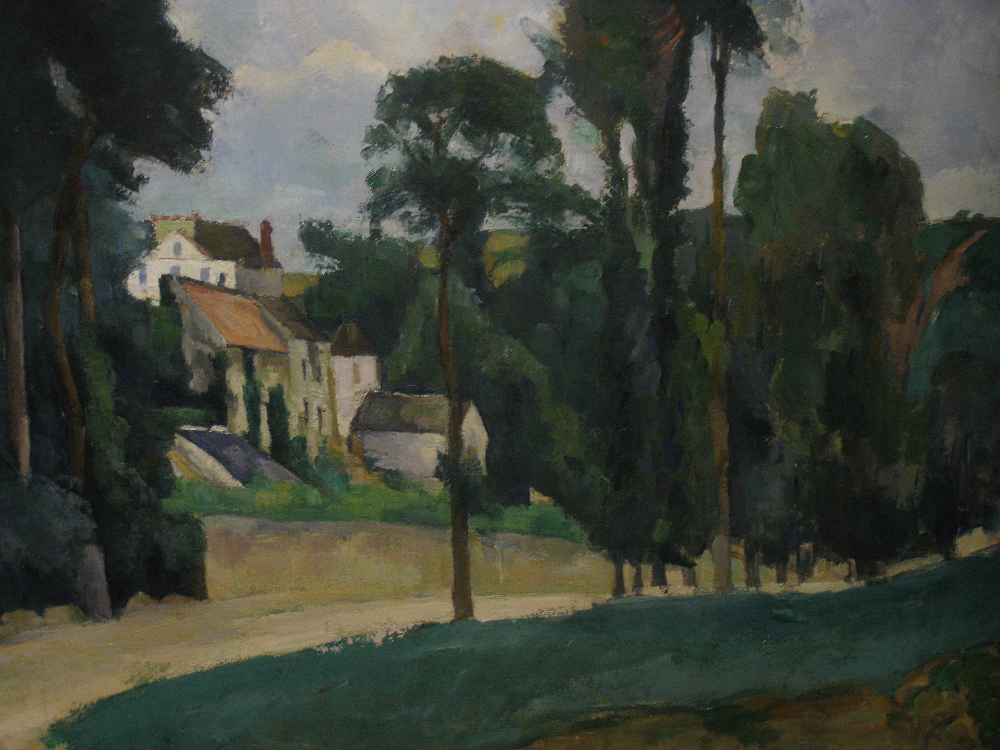

## 基本信息

- 作者：[[塞尚 Paul Cézanne]]
- 创作年代：1875
- 材质：油彩，画布 (*not from wiki*)
- 尺寸：(*not from wiki*) 约 58 × 71 cm
- 现存地：(*not from wiki*) 流转 / 私人收藏

## 画面与技法

[[塞尚 Paul Cézanne]] 1875 与 [[毕沙罗 Camille Pissarro]] 同题作品——见 [[蓬图瓦兹的道路 (毕沙罗) The Saint-Antoine Road at l'Hermitage]] 的对比记录。

顾衡 053 用本作论证：**即使在受毕沙罗影响最深的时期，塞尚也表现出与印象派本质上的不同**——

- 远景的房子、树
- **尤其右下角山坡上的那片草地**——**向几何图形靠近的结构性**

[[罗杰·弗莱 Roger Fry]] 对此现象的概括："塞尚的知性要求他对眼睛所见的景色进行分节，以产生结构性。为了处理自然的连续性，它必然被看作是不连续的；因为没有组织，没有结构，知性就没有杠杆。" —— 见 [[分节 Articulation]]。

## 历史背景 (*not from wiki*)

1875 处于塞尚"印象派学徒期"的尾段。本作之后两三年内，塞尚的笔触进一步规整化（典型为《[[曼西之桥 Bridge at Maincy]]》1882），结构性与笔触方向性彻底脱离印象派。

## 图片清单

| 编号 | 出自 | 描述 |
|---|---|---|
| 01 | [[053｜塞尚2：如何打造艺术的平行世界？]] | 全图 |

## 出现在

- [[053｜塞尚2：如何打造艺术的平行世界？]] —— 与毕沙罗同题对照；塞尚"分节式结构性"的早期表现
