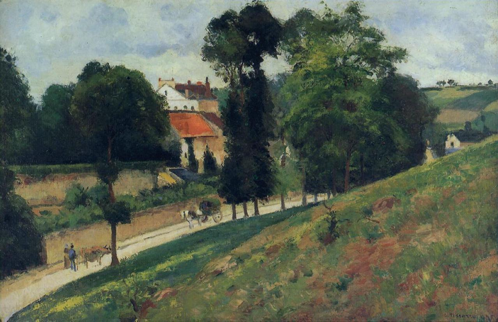

## 基本信息

- 作者：[[毕沙罗 Camille Pissarro]]
- 创作年代：1875
- 材质：油彩，画布 (*not from wiki*)
- 尺寸：(*not from wiki*) 约 52 × 81 cm
- 现存地：(*not from wiki*) 苏黎世美术馆

## 画面与技法

[[毕沙罗 Camille Pissarro]] 与 [[塞尚 Paul Cézanne]] **同题画作**之一——两人 1875 年同时立于蓬图瓦兹同一片风景前作画。顾衡 053 将本作与塞尚《[[蓬图瓦兹的道路 (塞尚) Road at Pontoise]]》并置对比：

- **毕沙罗：飘逸灵动（"峨眉派"）** —— 五彩斑斓、呈现**生动的细节**；无线条无结构，每个小色块色彩与明暗画对了整幅就对了——典型的[[印象派 Impressionism]] "马赛克"式画法。
- **塞尚：势大力沉（"少林派"）** —— 远景房屋、树木**向几何图形靠近的结构性**，尤其右下角山坡草地。

## 历史背景 (*not from wiki*)

本作是 1870s 中期毕沙罗、塞尚长期共同写生关系的关键文献——展示了同一时间同一景前**两种艺术观对眼睛所见的不同处理**：印象派的视觉直录 vs 塞尚的"知性 / 分节 / 结构性"重组。

## 图片清单

| 编号 | 出自 | 描述 |
|---|---|---|
| 01 | [[053｜塞尚2：如何打造艺术的平行世界？]] | 全图 |

## 出现在

- [[053｜塞尚2：如何打造艺术的平行世界？]] —— 与塞尚同题对照；印象派"过眼不过脑" vs 塞尚"知性 / 分节"
