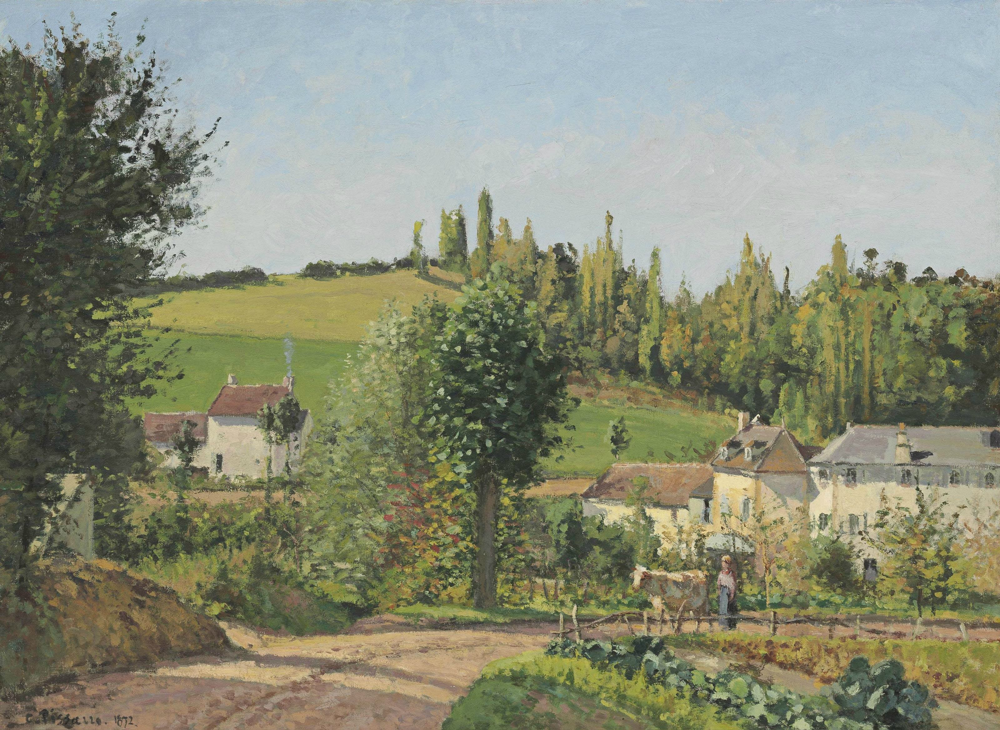

## 基本信息

- 作者：[[毕沙罗 Camille Pissarro]]
- 创作年代：1872
- 材质：布面油画 (*not from wiki*)
- 尺寸：(*not from wiki*) 约 54 × 73 cm
- 现存地：(*not from wiki*) 私人收藏

## 画面与技法

[[毕沙罗 Camille Pissarro]] **1890 前隐居乡间时期**的代表作——蓬图瓦兹近郊一组不起眼的农舍屋顶、田垄、远树。**色调和笔触恬淡含蓄**——是顾衡 044 对毕沙罗"**恬淡内敛**"风格的核心样本。

## 在课程中的角色

顾衡 044 用以演示毕沙罗 1890 年前的乡居期"**画的是农村不起眼的风景**"——这种"豆腐青菜"式的低调画作正是 044 顾衡为毕沙罗"市场暂时不如莫奈"做出辩护的实物证据。

## 图片清单

| 编号 | 出自 | 描述 |
|---|---|---|
| 01 | [[044｜莫利索和毕沙罗：最纯正的印象派什么样？]] | 全画 |

## 出现在

- [[044｜莫利索和毕沙罗：最纯正的印象派什么样？]] —— 毕沙罗乡居"恬淡内敛"风格样本
- [[毕沙罗 Camille Pissarro]] —— 代表作之一
