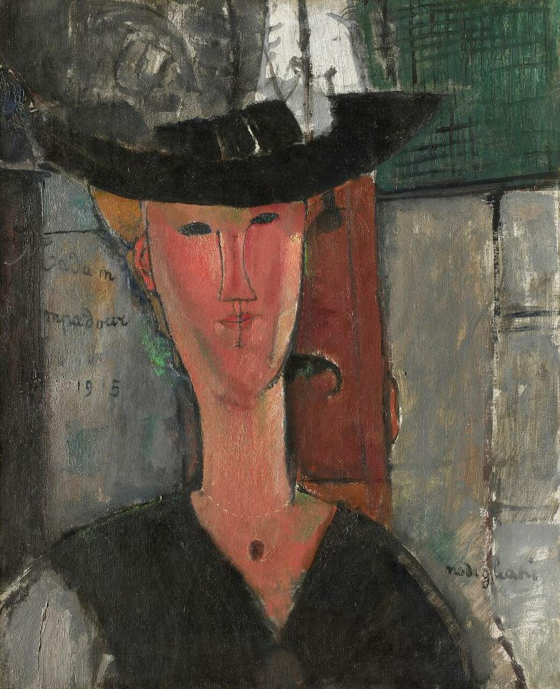

## 基本信息

- 作者：[[莫迪里阿尼 Amedeo Modigliani]]
- 创作年代：1915
- 材质：布面油画 (*not from wiki*)
- 尺寸：约 61 × 50 cm (*not from wiki*)
- 现存地：芝加哥艺术博物馆 The Art Institute of Chicago (*not from wiki*)

## 画面与技法

模特是英国女作家 **比阿特丽斯·黑斯廷** (Beatrice Hastings)——《新时代》杂志派到巴黎撰写"巴黎印象"专栏的记者，不久成为 [[莫迪里阿尼 Amedeo Modigliani]] 众多情人之一（顾衡 078）。

**形象来源**：顾衡 078 明示——**显然来自于莫迪里阿尼 1909 年为女像柱头像所作的草图**（[[女像柱头像 (莫迪里阿尼) Caryatid Head]]）。雕塑时期的形式原则被完整移植到了油画中。

**题名讽刺**：比阿特丽斯出身中产阶级，**有着对贵族生活和身份的渴慕和虚荣**——和真正的 [[蓬巴杜夫人 Madame de Pompadour]]（[[路易十五 Louis XV]] 的情妇、[[洛可可 Rococo]] 的灵魂人物）一样。莫迪里阿尼走的却是**波希米亚风**——两人三观不合。把比阿特丽斯的肖像起名《蓬巴杜夫人》是**对她的讽刺**（顾衡 078）。

## 历史背景 (*not from wiki*)

比阿特丽斯·黑斯廷 (1879–1943) 是英国新闻人 / 作家、女性主义者；与莫迪里阿尼的恋情持续约 1914–1916 年，期间她为莫迪里阿尼留下大量画作模特。

## 图片清单

| 编号 | 出自 | 描述 |
|---|---|---|
| 01 | [[078｜莫迪里阿尼：画中女子为什么让人一眼难忘？]] | 戴黑帽半身像，标志性长脖长鼻 |

## 出现在

- [[078｜莫迪里阿尼：画中女子为什么让人一眼难忘？]]
