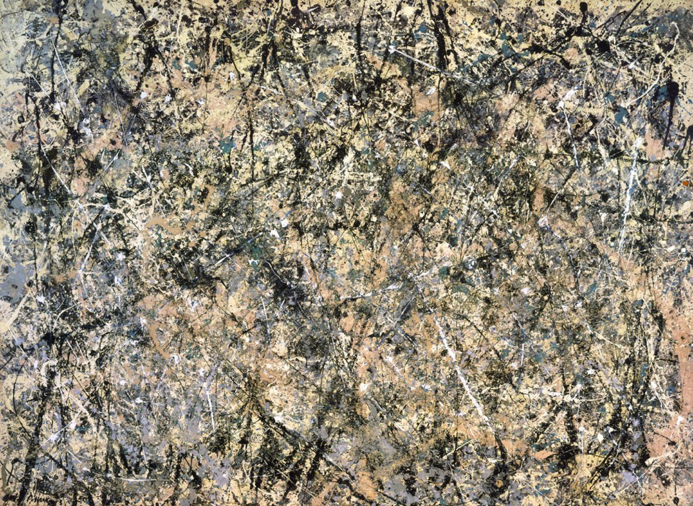

## 基本信息

- 作者: [[波洛克 Jackson Pollock]]
- 创作年代: 1950
- 材质: 布面油画/铝粉/瓷釉 (滴画法)
- 尺寸: 221 × 300 cm (*not from wiki*)
- 现存地: 美国国家美术馆 (*not from wiki*)

## 画面与技法

> Stub. 097 引为德·库宁讨论中波洛克成熟期代表作之一。

## 图片清单

| 编号 | 出自 lecture | 描述 |
|---|---|---|
| 01 | [[097｜德·库宁：抽象表现主义追求什么？]] | 全图 |

## 出现在

- [[097｜德·库宁：抽象表现主义追求什么？]]
