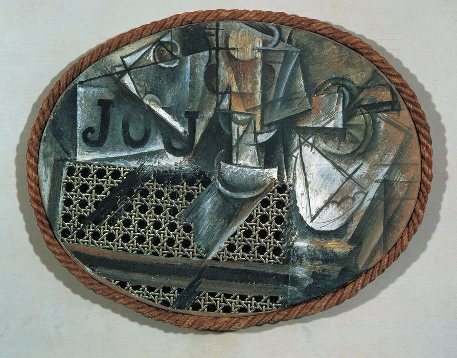
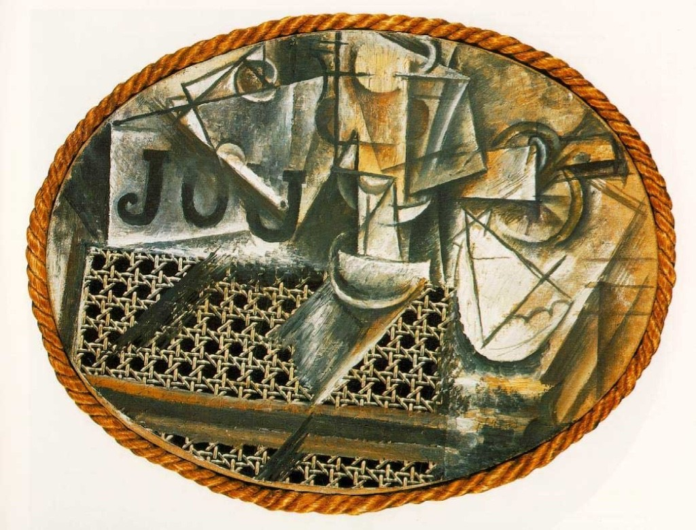

## 基本信息

- 作者：[[毕加索 Pablo Picasso]]
- 创作年代：1912 (*not from wiki*)
- 材质：油画、上漆布、绳子 / 拼贴 (oil and oilcloth on canvas, edged with rope) (*not from wiki*)
- 尺寸：约 29 × 37 cm（椭圆形）(*not from wiki*)
- 现存地：巴黎毕加索博物馆 Musée Picasso, Paris (*not from wiki*)

## 画面与技法

椭圆画面里出现了几样物事——烟斗、报刊片段（JOU = "JOURNAL" 缩写）、玻璃杯、柠檬——下半部分**不是画上去**的，而是一张**印有藤椅纹样的上漆布**直接被毕加索贴上画布。画的边缘用一圈**麻绳**绕起来当画框。

这件作品在西方艺术史上被广泛视为**第一件 collage（拼贴）作品**，把工业印刷品、现成材料引入"绘画"——彻底动摇了"画家把图像画在画面上"的前提。(*not from wiki*)

## 历史背景

(*not from wiki*) 1912 年正是分析立体主义向综合立体主义过渡的关键时刻；毕加索与勃拉克 (Georges Braque) 几乎同时在试验 *papier collé* 与 collage 技术。本作通常被指认为综合立体主义的开端事件。详见 lecture 066–067（毕加索系列）。

顾衡在 [[001｜总导论：艺术到底属于谁？]] 用它做开场例子：翠花看到这幅画的第一反应是"别人画上去的，毕加索咋是贴上去的？卖那么贵脑子是不是进水了？"——既是普通人面对现代艺术的真实困惑，也引出"我们需要的是阐释，不是好恶"这条本课主张。

## 图片清单

| 编号 | 出自 | 描述 |
|---|---|---|
| 01 | [[001｜总导论：艺术到底属于谁？]] | 整体图 |
| 02 | [[067｜毕加索4：什么是综合立体主义？]] | 整体图（不同扫描版本；067 用作综合立体主义 / 拼贴诞生样本） |

## 出现在

- [[001｜总导论：艺术到底属于谁？]]
- [[067｜毕加索4：什么是综合立体主义？]]
