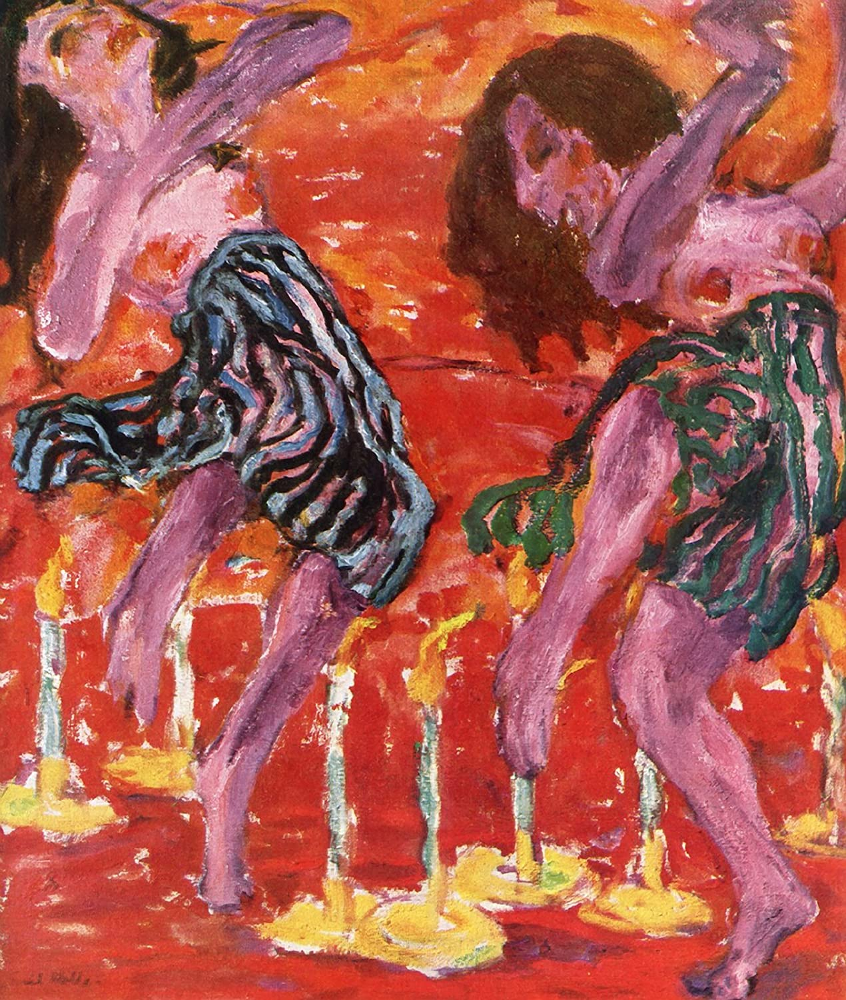

## 基本信息

- **作者**：[[诺尔德 Emil Nolde]]
- **创作年代**：1917
- **材质**：布面油画 (*not from wiki*)
- **尺寸**：100.5 × 86.5 cm (*not from wiki*)
- **现存地**：诺尔德基金会 Nolde Stiftung Seebüll (*not from wiki*)

## 画面与技法

- 072 中作为诺尔德**"形的崩溃"标志性三联例**之一（与 [[疯狂跳舞的孩子 (诺尔德) Wildly Dancing Children]]、[[围着金牛犊的舞蹈 (诺尔德) Dance Around the Golden Calf]] 并列）。
- **色彩主导**——"鲜艳到刺眼"的色彩；情色、尖叫、狂笑和身体剧烈的扭动背后是**画家内心深深的焦虑**。
- 这种焦虑正是 [[克尔凯郭尔 Søren Kierkegaard]] (*not from wiki*) 所谓"**瞬间与永恒相交时人类所产生的精神状态**"——宗教带给诺尔德最刻骨铭心的体验。

## 历史背景 (*not from wiki*)

1917 一战中段创作——舞蹈与火焰母题既是宗教激情的外化，也是欧洲战争创伤的反向显影。

## 图片清单

| 编号 | 出自 | 描述 |
|---|---|---|
| 01 | [[072｜桥社：什么是表现主义绘画的使命？]] | Candle Dancers 1917 — 形崩溃、宗教焦虑 |

## 出现在

- [[072｜桥社：什么是表现主义绘画的使命？]]
