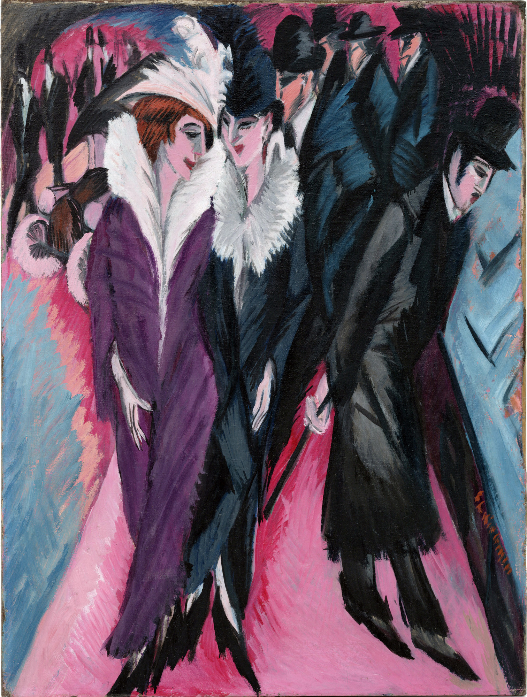
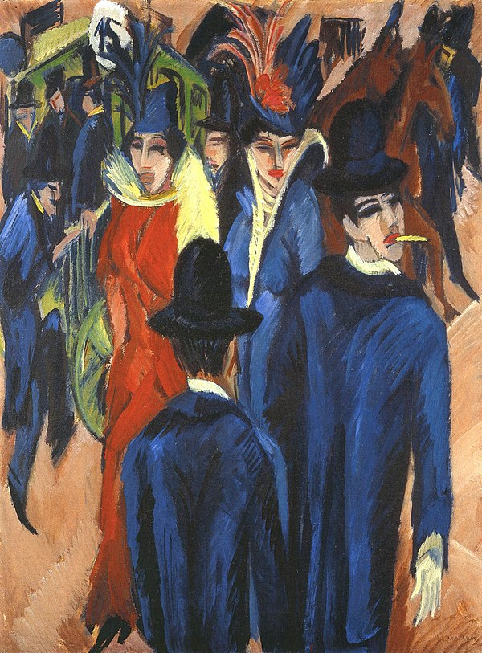

## 基本信息

- **作者**：[[基希纳 Ernst Ludwig Kirchner]]
- **创作年代**：1913
- **材质**：布面油画 (*not from wiki*)
- **尺寸**：120.6 × 91.1 cm (*not from wiki*)
- **现存地**：纽约现代艺术博物馆 (MoMA) (*not from wiki*)

## 画面与技法

- **题材**：柏林街景中的妓女与都市行人——基希纳偏好的"堕落的妓女、哥特式高耸的建筑"母题之一。
- **风格**：尖尖的造型、阴郁的色调、鬼魅一样的人体——072 中明确点名为 [[爱德华·蒙克 Edvard Munch]] **影响痕迹"显而易见"**的作品之一。
- **色彩**：受 [[野兽派 Fauvism]] / [[马蒂斯 Henri Matisse]] 启发的主观纯色 + 北方哥特风的冷峻 → [[表现主义 Expressionism]] 早期的典型画面。

## 历史背景 (*not from wiki*)

1913 年正是 [[桥社 Die Brücke]] 解体之年，也是基希纳"街景"系列（1913–1914，约 7 件）创作高峰——一战前柏林都市生活的现代性、欲望与异化的视觉浓缩。

## 图片清单

| 编号 | 出自 | 描述 |
|---|---|---|
| 01 | [[072｜桥社：什么是表现主义绘画的使命？]] | Street, Berlin 1913 — 视角 1 |
| 02 | [[072｜桥社：什么是表现主义绘画的使命？]] | Street, Berlin 1913 — 视角 2（或同系列另一构图） |

## 出现在

- [[072｜桥社：什么是表现主义绘画的使命？]]
