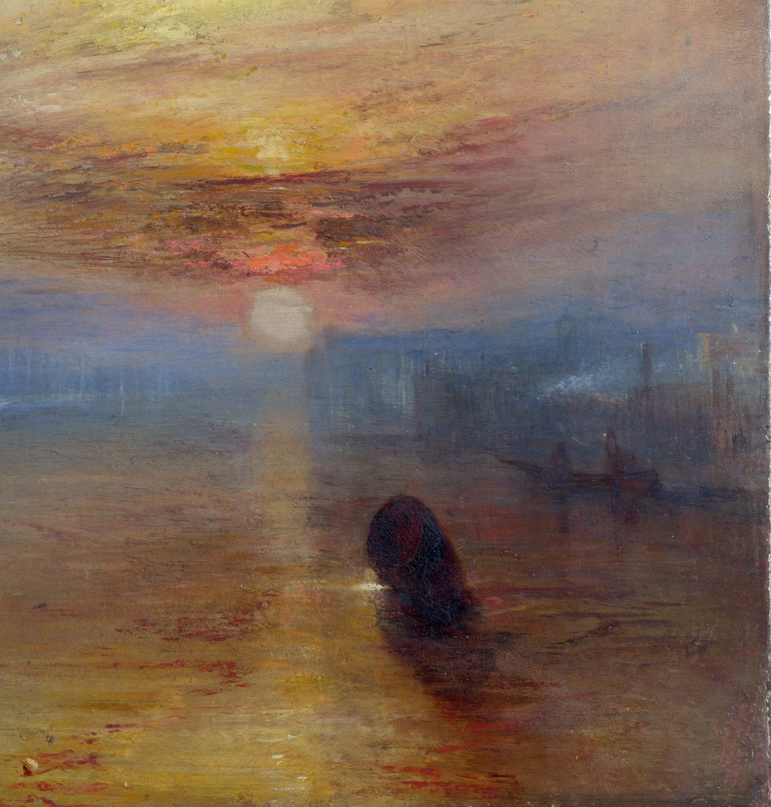

## 基本信息

- 作者：[[透纳 J. M. W. Turner]]
- 创作年代：1839
- 材质：布面油画 (*not from wiki*)
- 尺寸：90.7 × 121.6 cm (*not from wiki*)
- 现存地：英国伦敦国家美术馆 (*not from wiki*)

## 画面与技法

夕阳下，一艘小型蒸汽拖船拖着曾在特拉法加海战立下战功的"无畏号"风帆战舰，驶向泰晤士河上的拆船厂。

顾衡 042 的双层解读：

1. **主题层**："**这条军舰凝集了英国人民太多的情感**"——2005 年被评选为"英国最伟大的画作"。
2. **形式层**——英国"四面环海、潮湿多雾"的环境逼出透纳的独特风格：**作画时考虑到水汽和光线的作用，物体就会变得模糊，主题和情节因而退居二线**，给透纳"提供了自由和纯粹的空间，专心研究光线和水汽的关系"。

**对印象派的直接影响**（042 顾衡核心论证）：与《[[日出·印象 Impression, Sunrise]]》右下局部对比——"**大面积的平涂、分散而独立的线条用以强化局部的色彩效果，这些都是透纳式的**"——证明《日出·印象》是莫奈对透纳的致敬之作、**而非成熟印象派**。

## 历史背景 (*not from wiki*)

无畏号 (HMS Temeraire) 是 1798 年下水的英国皇家海军三层战列舰，曾参与 1805 年特拉法加海战、在纳尔逊旗舰胜利号 (HMS Victory) 旁作战。1838 年退役被拖往伦敦罗瑟希思的约翰·比蒂船坞拆解；透纳据说目击了这一历史性时刻，遂创作此画。该作 1839 年在皇家美术院展出。

## 图片清单

| 编号 | 出自 | 描述 |
|---|---|---|
| 01 | [[042｜莫奈2：《日出·印象》是不是印象派作品？]] | 全画：夕阳下蒸汽拖船拖曳风帆战舰 |
| 02 | [[042｜莫奈2：《日出·印象》是不是印象派作品？]] | 局部：右下区域，平涂与分散线条 — 与《日出·印象》对比用 |

## 出现在

- [[042｜莫奈2：《日出·印象》是不是印象派作品？]]
