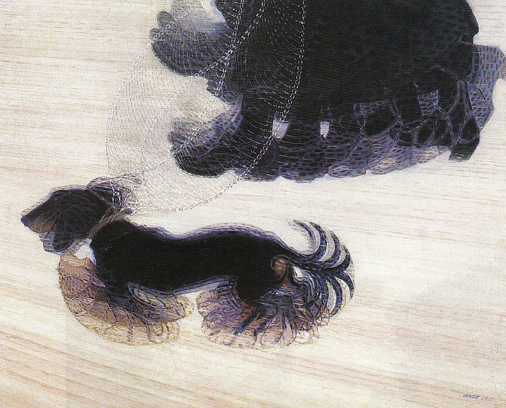
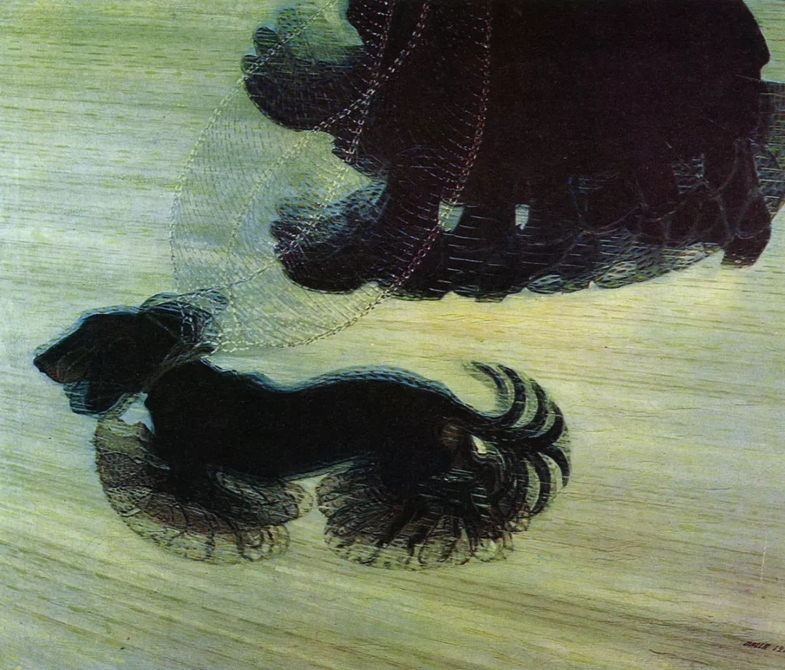

## 基本信息

- 作者：[[巴拉 Giacomo Balla]]
- 创作年代：1912
- 材质：布面油画 (*not from wiki*)
- 尺寸：约 89.8 × 109.8 cm (*not from wiki*)
- 现存地：水牛城 Albright-Knox 美术馆 (*not from wiki*)

## 画面与技法

参照 [[委拉斯贵支 Diego Velázquez]]《[[纺织工 The Spinners]]》中**转动的纱轮**的思路——把一只穿长裙的女人遛狗时狗腿与皮带的连续位置**全部叠合**在一帧画面里，以表现运动。

原本主题"太布尔乔亚了，愤怒呢？暴力呢？"——所以巴拉给起了煞有介事的名字《被拴住的狗的动态》："狗被拴着呢，不高兴。是这么个意思。"

## 历史背景

(*not from wiki*) [[未来主义 Futurism]] 绘画的标志性入门作品之一，1912 年完成，常被援引为"摄影式连续曝光"在画布上的视觉化兑现。

## 图片清单

| 编号 | 出自 | 描述 |
|---|---|---|
| 01 | [[080｜什么是未来主义？]] | 整体图——女人长裙与狗腿、皮带的连续叠合 |

## 出现在

- [[080｜什么是未来主义？]]
