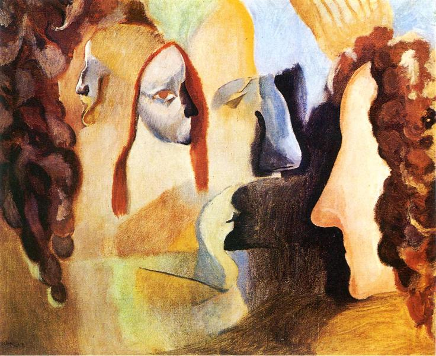

## 基本信息

- 作者：[[杜尚 Marcel Duchamp]]
- 创作年代：1911
- 材质：布面油画 (*not from wiki*)
- 尺寸：60 × 73 cm (*not from wiki*)
- 现存地：费城美术馆 (Philadelphia Museum of Art) (*not from wiki*)

## 画面与技法

杜尚给自己两个妹妹（Yvonne 和 Magdeleine）各画了两张角度不同的侧面像——其中一幅特意画成老妇人形象，**以暗示时间维度**。然后改变这四幅侧面像的比例，整合在同一画面上。

这是杜尚把"高维空间 + 多时间叠合"理论付诸绘画的较早尝试——属于他还在 [[分析立体主义 Analytical Cubism]]/[[皮托集团 Puteaux Group]] 阶段对四维空间和黎曼几何的"绘画实验"。

## 历史背景

(*not from wiki*) 1911 年作品。杜尚此时已是 [[皮托集团 Puteaux Group]] 一员，掌握着集团内最深的四维空间和黎曼几何知识。这幅与《[[杜尔西尼亚肖像 Portrait Dulcinea]]》一同标志他试图把抽象的物理/数学理论翻译进画面。

## 图片清单

| 编号 | 出自 | 描述 |
|---|---|---|
| 01 | [[089｜杜尚2：什么是他人生的转折点？]] | 四个侧面像叠合整图 |

## 出现在

- [[089｜杜尚2：什么是他人生的转折点？]]
