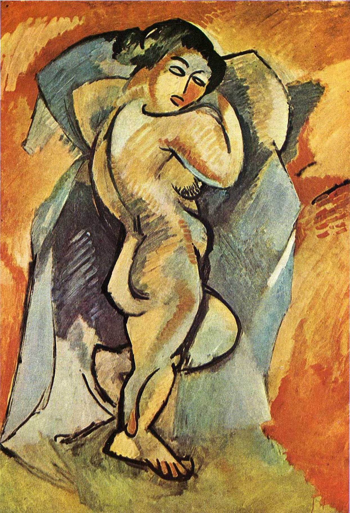

## 基本信息

- 作者：[[勃拉克 Georges Braque]]
- 创作年代：1908
- 材质：布面油画 (*not from wiki*)
- 尺寸：约 140 × 100 cm (*not from wiki*)
- 现存地：巴黎现代艺术博物馆 (Musée National d'Art Moderne, Centre Pompidou) (*not from wiki*)

## 画面与技法

勃拉克 1908 年在与毕加索深度沟通后画的大型裸体。明显**回应**[[亚威农少女 Les Demoiselles d'Avignon|《亚威农少女》]]——把女性身体棱角化、立方体化，**侧面身体加上正面眼睛**的程式与毕加索完全同源；面部、肩膀、髋部都被压扁、拼贴。

与毕加索 1909 年《[[坐着的男人 (毕加索 1909) Seated Male Nude|坐着的男人]]》**风格高度雷同**——再次证明两人在草创立体主义的早期合作之紧密。

## 历史背景 (*not from wiki*)

被视为**勃拉克回应《亚威农少女》的关键作品**——也是他真正放弃野兽派、转向立体主义的标志。

## 图片清单

| 编号 | 出自 | 描述 |
|---|---|---|
| 01 | [[068｜立体主义，除了毕加索还值得了解什么？]] | 勃拉克立体化裸体；与毕加索同期裸体配对呈现 |

## 出现在

- [[068｜立体主义，除了毕加索还值得了解什么？]] —— 与毕加索同期裸体风格雷同的例证
