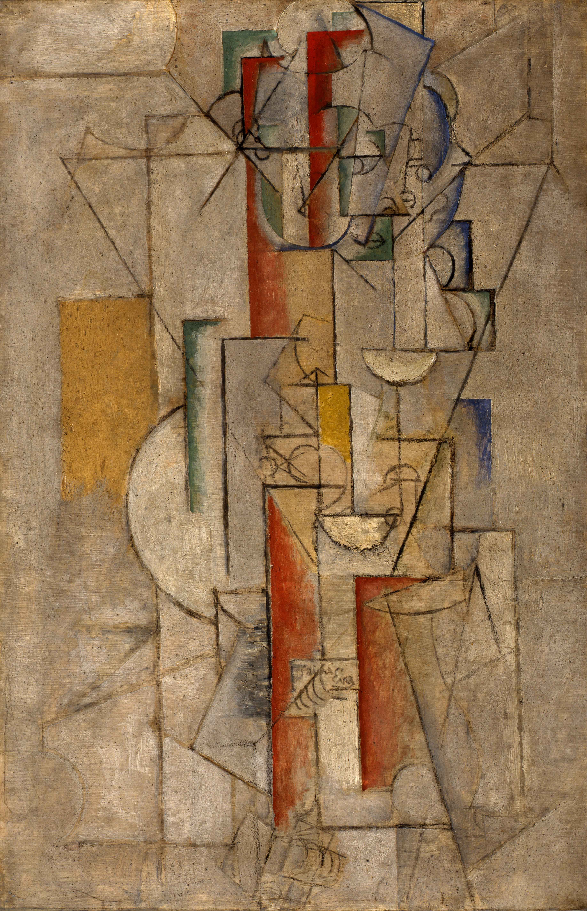

## 基本信息

- 作者：[[毕加索 Pablo Picasso]]
- 创作年代：1912
- 材质：(*not from wiki*) 布面油画
- 尺寸：年代不详
- 现存地：(*not from wiki*) Columbus Museum of Art, Ohio

## 画面与技法

[[分析立体主义 Analytic Cubism]] 晚期作品。画面以**单一褐色调**把伊娃的身体分解为几何碎片，画面上明显题写 "J'aime Eva"（我爱伊娃）作为身份提示。顾衡 067 把它与同期的《[[伊娃在扶手椅中 Eva in an Armchair]]》一起作为"分析立体主义抹掉颜色"原则的样本。

## 历史背景

(*not from wiki*) 伊娃·古埃尔 (Eva Gouel) 是毕加索 1911-1915 的情人，毕加索在多幅作品里把 "J'aime Eva"、"Ma Jolie" 等情话直接嵌入画面，构成立体主义"文字-图像"互文的标志性手法之一。

## 图片清单

| 编号 | 出自 | 描述 |
|---|---|---|
| 01 | [[067｜毕加索4：什么是综合立体主义？]] | 整体图 |

## 出现在

- [[067｜毕加索4：什么是综合立体主义？]]
