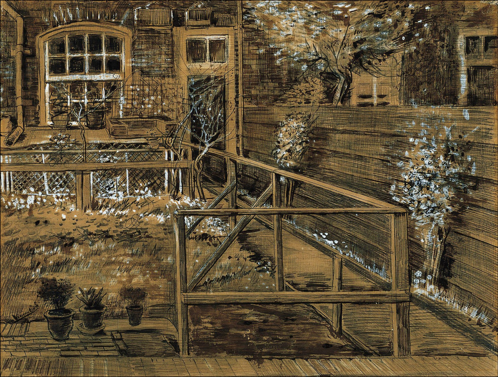

## 基本信息

- 作者：[[凡·高 Vincent van Gogh]]
- 创作年代：1882
- 材质：素描 (*not from wiki*)
- 尺寸：—
- 现存地：—

## 画面与技法

凡·高 1882 年在海牙与 [[西恩·霍尼克 Sien Hoornik]] 同居期间所作的家居环境素描——主角是 西恩母亲家 的后花园。057 中与《悲伤》《停尸床上的女人》一并展示，构成"海牙—西恩时期"作品组。

## 历史背景 (*not from wiki*)

凡·高在海牙时期反复绘制 Sien 的母亲、家人与居所，将自己视为这个底层家庭的成员；这种"想替整个家族赎罪"的姿态，是 057 所述凡·高第三次"为女人作大死"的全貌。

## 图片清单

| 编号 | 出自 | 描述 |
|---|---|---|
| 01 | [[057｜凡·高1：为什么说他"性格决定命运"？]] | 凡·高 1882 年《西恩母亲的后花园》 |

## 出现在

- [[057｜凡·高1：为什么说他"性格决定命运"？]]
