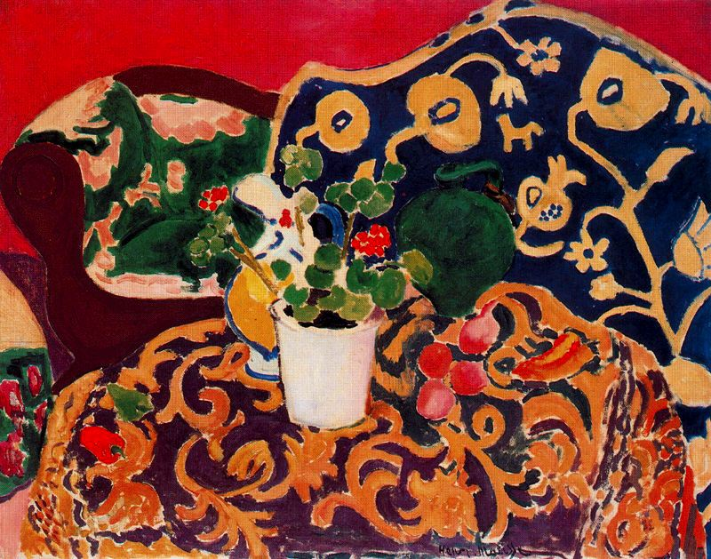

## 基本信息

- 作者：[[马蒂斯 Henri Matisse]]
- 创作年代：1911
- 材质：油画 (*not from wiki*)
- 尺寸：(*not from wiki*)
- 现存地：(*not from wiki* 圣彼得堡 / 冬宫博物馆)

## 画面与技法

062 把此画安插在"**一战爆发后马蒂斯很奇怪地进入了一个 [[立体主义 Cubism]] 时期**"的叙事节点之前一格——作为该时期的样板。具体进入立体主义的原因顾衡留到讲毕加索时再说。

(*not from wiki*) 画面表面布满阿拉伯式花纹密布的纺织品与盆栽静物——典型马蒂斯式装饰性饱和构图。

## 历史背景 *(not from wiki)*

(*not from wiki*) 1910–1911 马蒂斯访问西班牙塞维利亚（Seville）期间创作的两幅"塞维利亚静物"之一，受北非与伊斯兰艺术启发后开始大量使用阿拉伯式花纹——为后续晚期"加阿拉伯风格花纹、更强调装饰性"的特点埋下伏笔。

## 图片清单

| 编号 | 出自 | 描述 |
|---|---|---|
| 01 | [[062｜马蒂斯3：如何理解他一生的创作？]] | 静物布满花纹纺织品 |

## 出现在

- [[062｜马蒂斯3：如何理解他一生的创作？]] —— 一战立体主义短插曲的前缘
