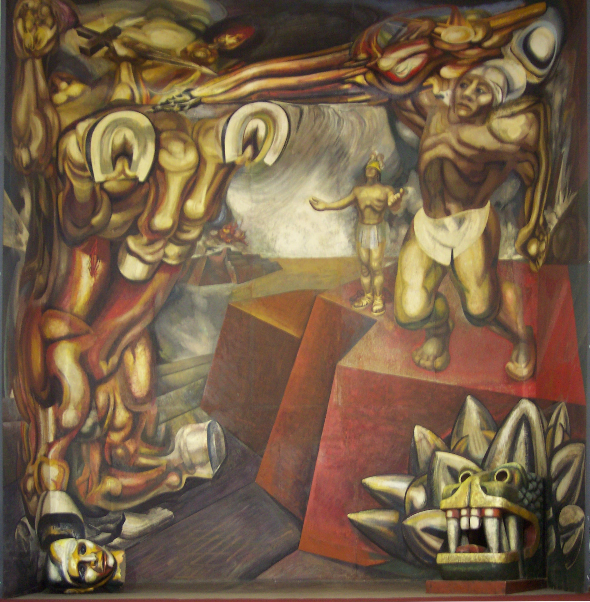

## 基本信息

- 作者：[[西盖罗斯 David Alfaro Siqueiros]]
- 创作年代：1944
- 材质：壁画 (*not from wiki*；工业涂料 + 喷壶法)
- 尺寸：(*not from wiki*)
- 现存地：(*not from wiki*)

## 画面与技法

西盖罗斯把巨大画布铺在地上、用喷壶往画布上喷工业涂料的"激进新画法"案例。本课重点不是画面本身，而是它代表的**工艺范式**——后来被 [[波洛克 Jackson Pollock]] 转化为 [[滴画法 Drip Painting]]。

## 历史背景 (*not from wiki*)

1944 年正值墨西哥壁画运动 (Mexican Muralism) 全盛期。西盖罗斯与里维拉、奥罗斯科并称"墨西哥壁画三杰"。他在 1930 年代纽约时期对工业涂料 + 大尺幅平面铺地的实验，是 20 世纪绘画工艺的重要试验场。

## 图片清单

| 编号 | 出自 | 描述 |
|---|---|---|
| 01 | [[096｜波洛克：什么是当代艺术的第一个流派？]] | 西盖罗斯壁画 (1944) |

## 出现在

- [[096｜波洛克：什么是当代艺术的第一个流派？]]
