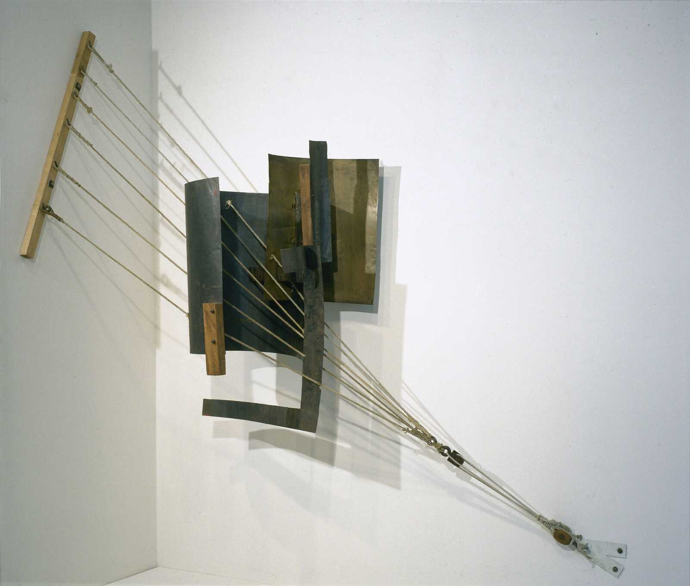

## 基本信息

- 作者：[[塔特林 Vladimir Tatlin]]
- 创作年代：1914（部分研究记作 1915 在《[[最后的未来主义：从0到10 0.10 The Last Futurist Exhibition]]》展出版本）
- 材质：铁、铜、木、绳索的悬挂构造 (*not from wiki*)
- 尺寸：年代不详 (*not from wiki*)
- 现存地：原作多已散失，现存复制品于俄罗斯博物馆等 (*not from wiki*)

## 画面与技法

[[构成主义 Constructivism]] 的开山之作——**把 [[毕加索 Pablo Picasso]] [[综合立体主义 Synthetic Cubism]] 的拼贴手法三维化**。塔特林自述："它是三维的，但既不是雕也不是塑。"

### 为什么挂在"角落"

塔特林**先选中展厅角落，再回去创作**——并专门给作品起名《角落里的反浮雕》。原因是：

> 这个角落是俄罗斯传统家庭悬挂 [[圣像 Icon]] 的地方——最神圣，也最显眼。

把传统圣像的位置让给完全抽象的三维构造，构成对俄罗斯东正教视觉传统的颠覆性接管。

### 与 [[黑方块 Black Square]] 的冲突

[[马列维奇 Kazimir Malevich]] 在 1915 年《[[最后的未来主义：从0到10 0.10 The Last Futurist Exhibition]]》画展上抢先把 [[黑方块 Black Square]] 挂到该角落——塔特林大怒，二人动手，结下梁子。这一冲突标志着 [[构成主义 Constructivism]] 与 [[至上主义 Suprematism]] **同一流派内部裂痕的起点**。

## 历史背景 (*not from wiki*)

塔特林从 1914 年开始创作"绘画浮雕 (painting reliefs)"系列，后发展为"反浮雕 (counter-reliefs)"——脱离墙面、悬挂于空间中、强调材料本身（铁、木、玻璃、绳）的物理属性与构件之间的张力。这一思路成为 [[构成主义 Constructivism]] **"物质的运动与张力"** 美学的源头。

## 图片清单

| 编号 | 出自 | 描述 |
|---|---|---|
| 01 | [[086｜塔特林：什么是构成主义？]] | 1914 角落版 |

## 出现在

- [[086｜塔特林：什么是构成主义？]]
