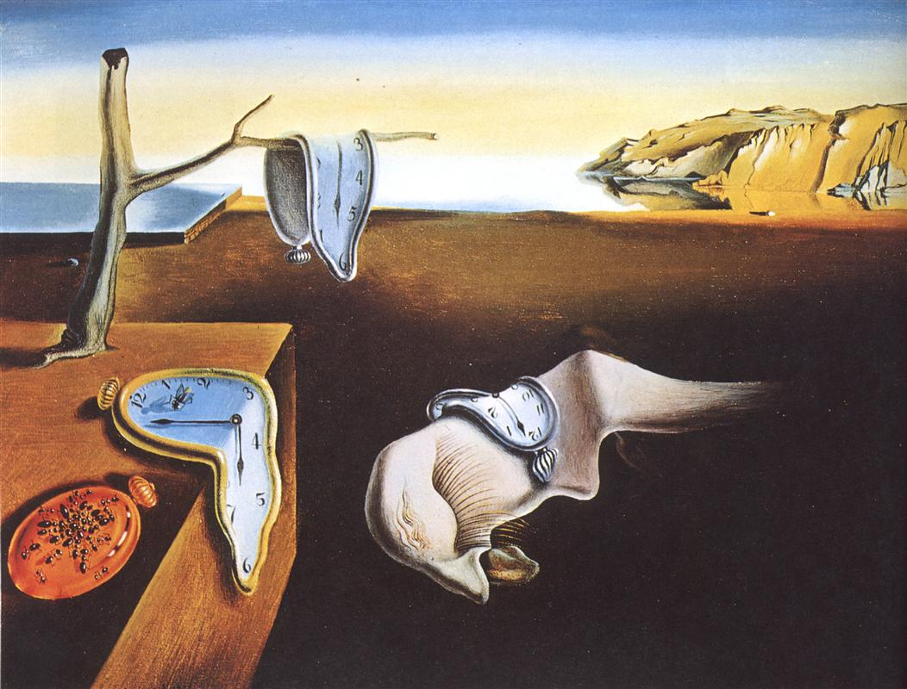
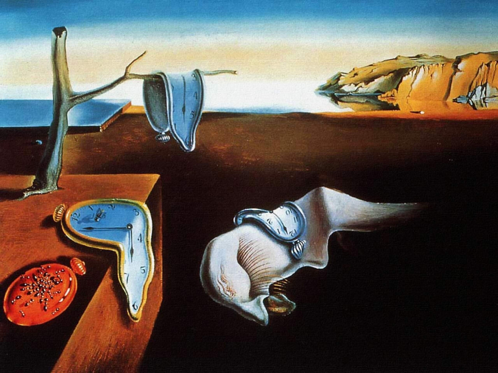

## 基本信息

- 作者：[[达利 Salvador Dalí]]
- 创作年代：1931
- 材质：布面油画 (*not from wiki*)
- 尺寸：(*not from wiki*) 24 × 33 cm（极小幅）
- 现存地：(*not from wiki*) 纽约现代艺术博物馆 MoMA（1934 年起馆藏）

## 画面与技法

092 仅以图像形式出现（无独立讨论），作为 [[超现实主义 Surrealism]] 最广为人知的图像样本列入。

(*not from wiki*) **"软钟 / 融化的钟"母题** 的诞生作——三只怀表在荒凉海岸景观中**像奶酪一样融化**：一只搭在枯枝上，一只搭在白色"睡眠中的脸"上，一只搭在方形台面边缘。第四只钟被**蚂蚁覆盖**（达利反复使用的"腐烂"母题）。背景为达利家乡 Cap de Creus 海岸（西班牙加泰罗尼亚）。

技法属于 [[超现实主义 Surrealism]] 的**梦境派 / 偏执狂批评派**：精确的学院写实笔法 + 不可能共存的物理逻辑——这与恩斯特/米罗的"[[自动写作 Automatic Writing]] 起手"路径形成对照。

## 历史背景 (*not from wiki*)

达利据其自述：晚饭后看着剩下的卡蒙贝尔奶酪软塌塌的样子，**两小时画完**这幅 24×33 cm 的小画。1931 年首展于巴黎超现实主义画展。1934 年朱利安·列维画廊以 250 美元卖给 MoMA。

## 图片清单

| 编号 | 出自 | 描述 |
|---|---|---|
| 01 | [[092｜超现实主义为什么会诞生？]] | 全图——超现实主义最著名图像样本 |

## 出现在

- [[092｜超现实主义为什么会诞生？]]
