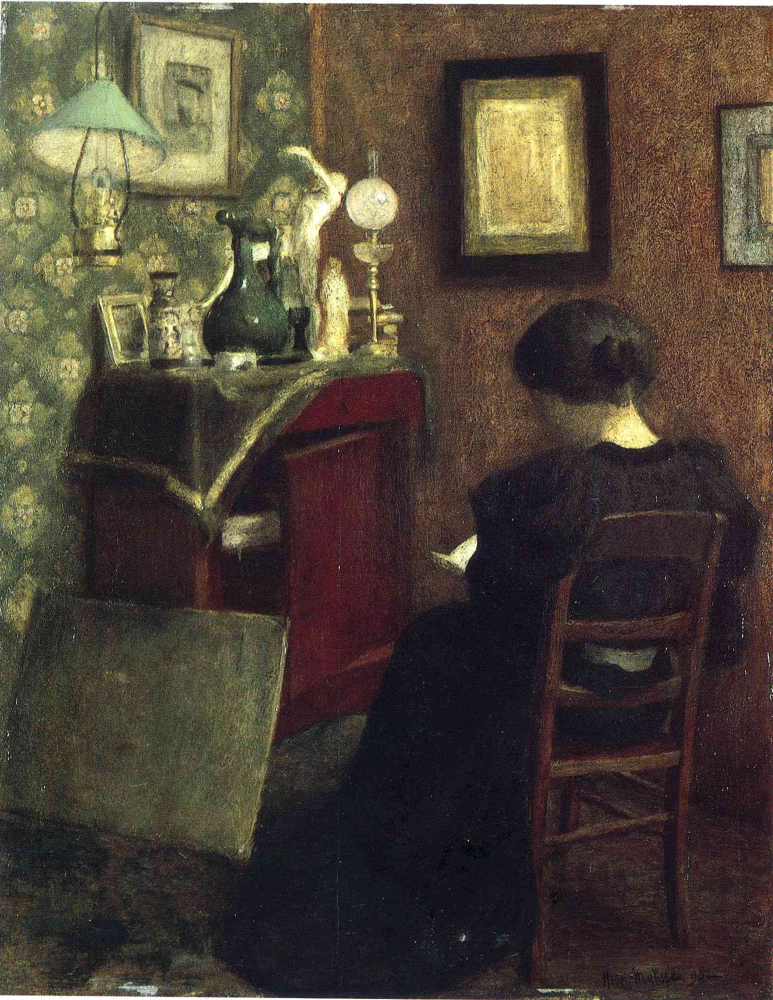

## 基本信息

- 作者：[[马蒂斯 Henri Matisse]]
- 创作年代：1894
- 材质：油彩，木板 (*not from wiki*)
- 尺寸：61.5 × 48 cm (*not from wiki*)
- 现存地：法国蓬皮杜艺术中心 / 国立现代艺术博物馆 (*not from wiki*)

## 画面与技法

[[马蒂斯 Henri Matisse]] **学院派沙龙入选作品**（060 明示）—— 1896 年马蒂斯第一次参加学院派沙龙，**五幅作品入选**，本作**被当时的法国总统当场买走**。

技法上仍是**典型学院派风格**：暗调室内场景、明暗法塑造体积、谨慎中性的色调——与马蒂斯日后野兽派的纯色色彩主义形成最强烈的对照。

## 历史背景 (*not from wiki*)

本作让马蒂斯在 1896 年成为**学院派沙龙永久成员**，享受作品免检待遇。但此时学院派已"江河日下"——"庙堂荒芜，功名就要去江湖寻找"。马蒂斯的人生选择 1 年后（1897）就因结识 [[毕沙罗 Camille Pissarro]] 而彻底转向。

## 图片清单

| 编号 | 出自 | 描述 |
|---|---|---|
| 01 | [[060｜马蒂斯1：野兽派从何而来？]] | 全图——学院派阶段作品 |

## 出现在

- [[060｜马蒂斯1：野兽派从何而来？]]
