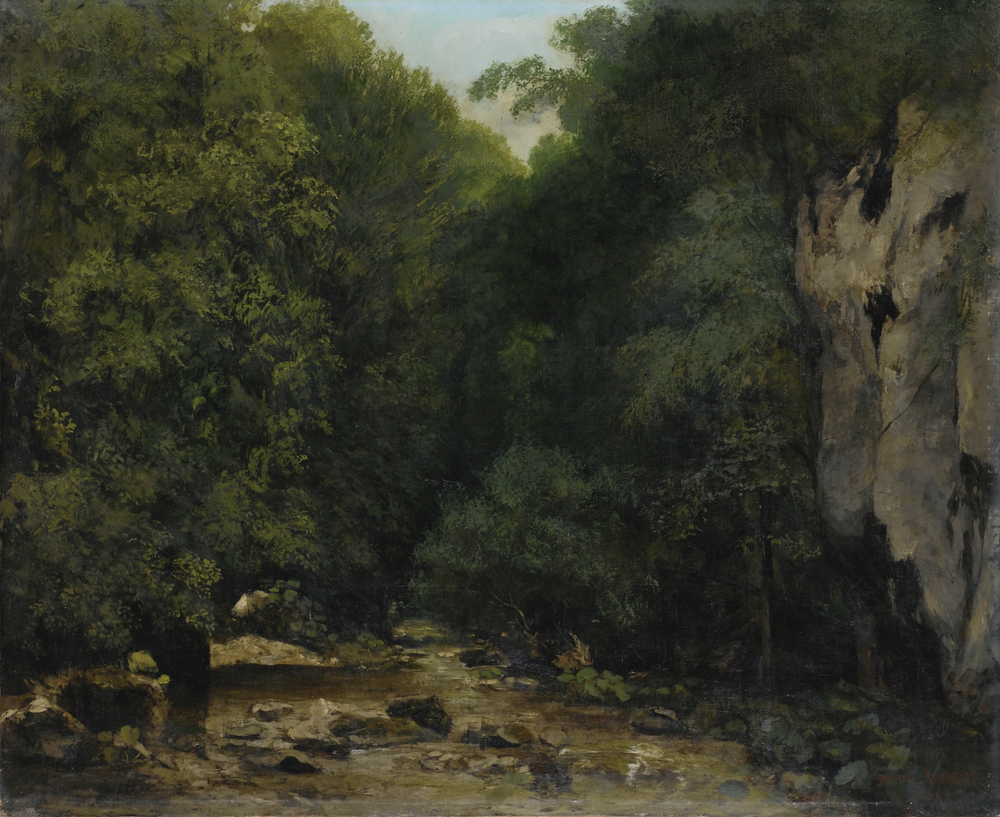

## 基本信息

- 作者：[[居斯塔夫·库尔贝 Gustave Courbet]]
- 创作年代：1864
- 材质：油彩，画布 (*not from wiki*)
- 尺寸：约 71 × 86 cm (*not from wiki*)
- 现存地：奥赛博物馆，巴黎 (*not from wiki*)

## 画面与技法

[[居斯塔夫·库尔贝 Gustave Courbet]] 在奥尔南附近自然山谷中所作的一件风景画。**景色极为普通**——一条小溪、几块石头、林木——按学院派传统毫无 [[风景画 Landscape Painting]] "入画性"。这正是顾衡 038 用来对比马奈与库尔贝的关键证据：库尔贝的现实主义是"我看见什么就画什么"，**拒斥宏大叙事，拒斥形而上学**（即 [[实证主义 Positivism]] 立场），与 [[象征时期风景 Symbolic Landscape]] 形成对立。

## 历史背景 (*not from wiki*)

奥尔南是库尔贝的家乡（[[035｜库尔贝：为什么现实主义的开创者争议那么大？]] 详述），他一生反复以此地溪流、岩洞、湖泊为题材。本作属于库尔贝"无情节风景"系列——挑战了风景画必须有人物点景、必须叙事、必须美的传统约束。

## 图片清单

| 编号 | 出自 | 描述 |
|---|---|---|
| 01 | [[038｜马奈1：为什么他是西方现代绘画的鼻祖？]] | 全图 |

## 出现在

- [[038｜马奈1：为什么他是西方现代绘画的鼻祖？]]
