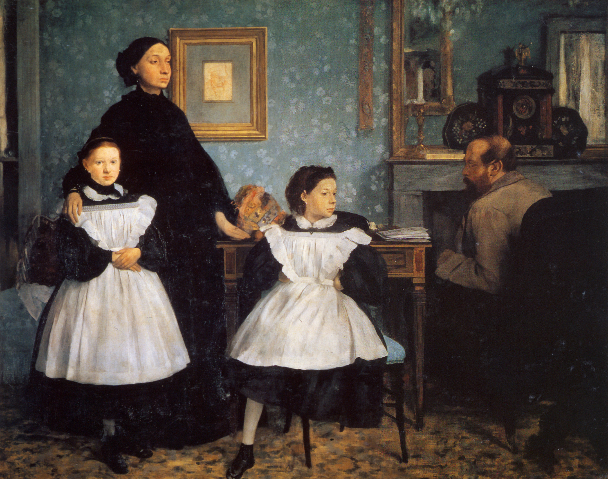

## 基本信息

- 作者：[[德加 Edgar Degas]]
- 创作年代：1860–1862
- 材质：布面油画 (*not from wiki*)
- 尺寸：200 × 253 cm (*not from wiki*)
- 现存地：(*not from wiki*) 巴黎奥赛博物馆 Musée d'Orsay

## 画面与技法

德加为其姑姑 Laura Bellelli 一家所作的大型群像（姑父 Gennaro Bellelli、两位表妹 Giovanna 和 Giulia）。**德加早期最用心的作品**，反映其在意大利游学期间对古典群像构图的吸收 (*not from wiki*)。

## 历史背景

045 顾衡明确指出：1867 年德加把这幅画送到 [[巴黎沙龙 Paris Salon]]，"沙龙虽然让他入选了，但是把他这幅画挂在一个很坏的位置，根本没什么人注意到。这可把德加气坏了，**从此以后再也不向沙龙送作品参展了**"——这是德加与体制决裂、走向 [[印象派 Impressionism]] 阵营的转折点。

## 图片清单

| 编号 | 出自 | 描述 |
|---|---|---|
| 01 | [[045｜德加：为什么印象派以他结束？]] | 全家四人群像 |

## 出现在

- [[045｜德加：为什么印象派以他结束？]]
