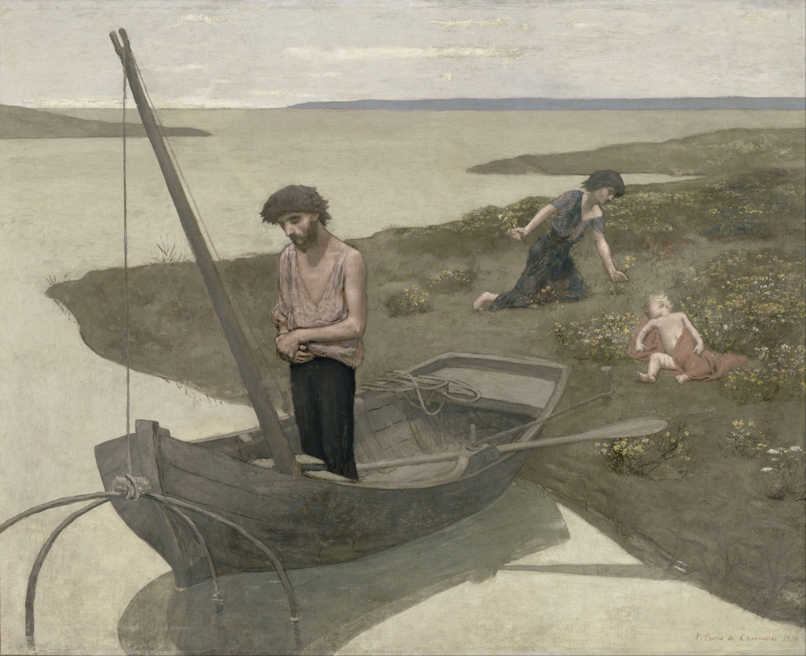

## 基本信息

- 作者：[[夏凡纳 Pierre Puvis de Chavannes]]
- 创作年代：1881
- 材质：油彩、画布 (*not from wiki*)
- 尺寸：约 155 × 192 cm (*not from wiki*)
- 现存地：法国巴黎 · 奥赛博物馆 (Musée d'Orsay, Paris) (*not from wiki*)

## 画面与技法

**[[夏凡纳 Pierre Puvis de Chavannes]] 风格的标志性样本**：画面里 **撒网后祷告的渔夫**、**身后采花的妻子**、**熟睡的孩子** 三个人物，呈 **舞台剧式的标准动作**——单独从画面中拎出来都能猜出在做什么。**水面采用简单平涂、连水纹都没有** —— 这种对细节的大胆简化来自 **意大利湿壁画** 的影响（参见 [[犹大之吻 (乔托) Kiss of Judas]] / [[耶稣进入耶路撒冷 (杜乔) Entry into Jerusalem]]）。

顾衡在 [[049｜夏凡纳：如何制作象征主义的密电码？]] 中指出：这种 **"祷告/采花/睡觉" 的意念和行为的标准动作**，正是 [[象征主义 Symbolism]] 所要的 **"主观的客观化"**——所以象征主义团体把夏凡纳奉为 **"当代最伟大的艺术大师"**。

## 历史背景 (*not from wiki*)

1881 年沙龙首次公开展出，引发争议但也获得部分前卫批评家的赞赏；此画后来影响了 [[高更 Paul Gauguin]]、[[毕加索 Picasso]] 等多代艺术家（毕加索蓝色时期对此画有明显回应）。

## 图片清单

| 编号 | 出自 | 描述 |
|---|---|---|
| 01 | [[049｜夏凡纳：如何制作象征主义的密电码？]] | 整幅画面 |

## 出现在

- [[049｜夏凡纳：如何制作象征主义的密电码？]] —— 用于说明 **舞台剧式标准动作** 与 **简化原则**
