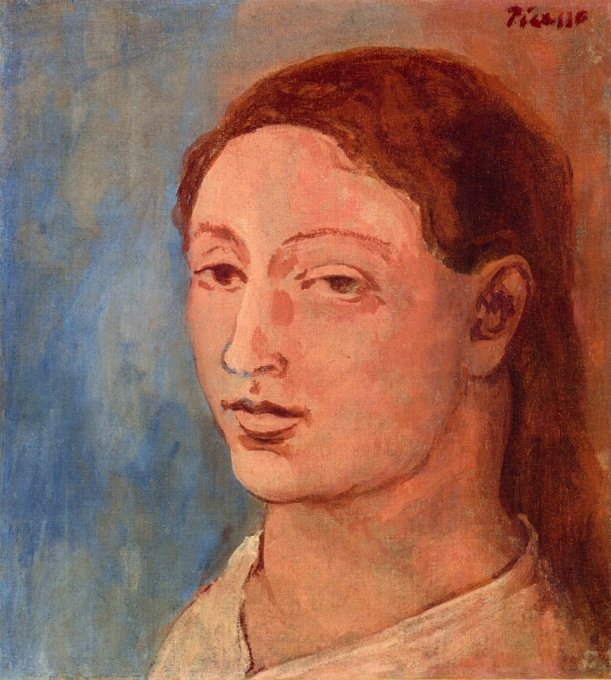

## 基本信息

- 作者：[[毕加索 Pablo Picasso]]
- 创作年代：1906
- 材质：布面油画 (*not from wiki*)
- 尺寸：年代不详 (*not from wiki*)
- 现存地：私人收藏 (*not from wiki*)

## 画面与技法

[[玫瑰红时期 Rose Period]] 代表作之一——毕加索 1904 年起的同居伴侣 [[费尔南德 Fernande Olivier]] 的头像。画面色调由蓝色时期的冷蓝换成温暖玫瑰红，但造型语言（[[夏凡纳 Pierre Puvis de Chavannes]] 式简化 + [[埃尔·格列柯 El Greco]] 式拉长 / 舞台定格）与蓝色时期完全一致——本讲将此作作为 **"玫瑰红时期只是换色"** 判词的支撑样本。

费尔南德的脸部已开始显示 1906 年毕加索受 **伊比利亚雕塑** 启发的"面具化"倾向，将一年后引出 [[立体主义 Cubism]]。 (*not from wiki*)

## 历史背景 (*not from wiki*)

- 创作于 1906 年——毕加索在西班牙 Gósol 度夏归来后；这一年他大量画费尔南德、伊比利亚雕塑、戈雅风格头像。

## 图片清单

| 编号 | 出自 | 描述 |
|---|---|---|
| 01 | [[064｜毕加索1：如何理解"蓝色时期"和"玫瑰红时期"？]] | 整幅画面 |

## 出现在

- [[064｜毕加索1：如何理解"蓝色时期"和"玫瑰红时期"？]]
