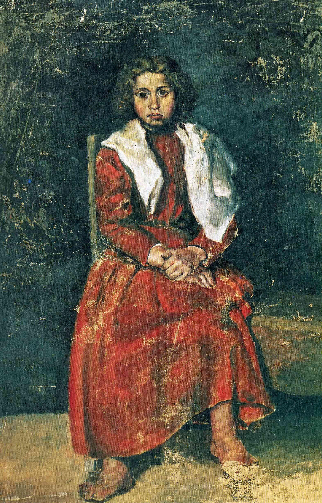

## 基本信息

- 作者：[[毕加索 Pablo Picasso]]
- 创作年代：1895
- 材质：布面油画 (*not from wiki*)
- 尺寸：约 75 × 50 cm (*not from wiki*)
- 现存地：马德里 Museo Reina Sofía / 毕加索博物馆藏品 (*not from wiki*)

## 画面与技法

毕加索 **14 岁** 时的作品——一名衣着褴褛的赤脚女孩坐姿肖像，色调沉郁、技法已具学院派写实功力。本讲将其作为 **天才少年的名声不胫而走** 的样本：毕加索在还没学会说话时就能把想吃的点心画出来管大人要、4 岁剪出姨妈秘密情人的肖像、14 岁画此画。

## 历史背景 (*not from wiki*)

- 此画作于毕加索父亲 José Ruiz Blasco 任职的拉科鲁尼亚 (A Coruña)，模特或为当地贫民街区少女。
- 是研究"毕加索学院训练完成度"的早期关键作品——次年（1896）他即考入巴塞罗那 La Llotja 美术学校，1897 年 16 岁考取马德里皇家美术学院。

## 图片清单

| 编号 | 出自 | 描述 |
|---|---|---|
| 01 | [[064｜毕加索1：如何理解"蓝色时期"和"玫瑰红时期"？]] | 整幅画面 |

## 出现在

- [[064｜毕加索1：如何理解"蓝色时期"和"玫瑰红时期"？]]
