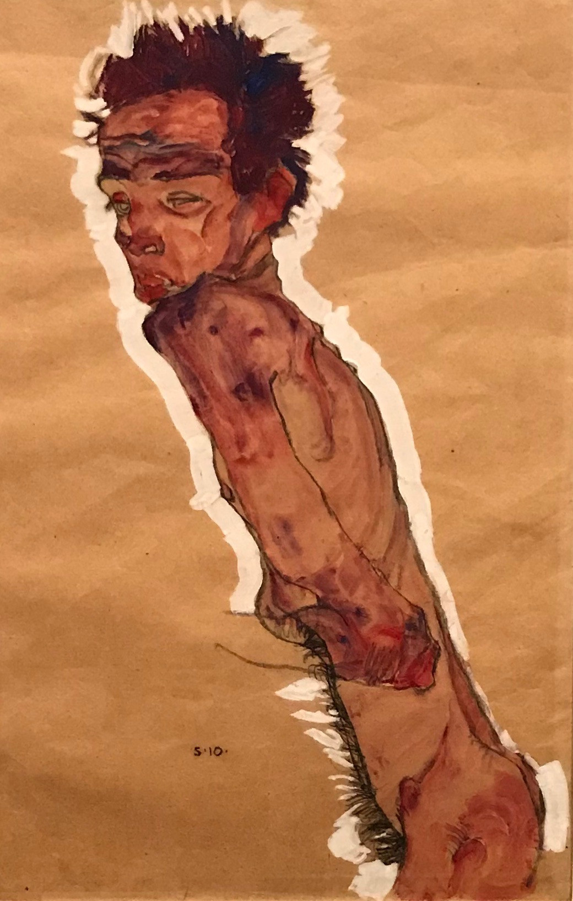

## 基本信息

- 作者：[[席勒 Egon Schiele]]
- 创作年代：1910
- 材质：（*not from wiki*）纸本 / 水彩 + 黑色粉笔
- 尺寸：（*not from wiki*）暂缺
- 现存地：（*not from wiki*）暂缺

## 画面与技法

顾衡 074 的核心案例之二——与《[[自画像 (席勒 1910) Self Portrait (Schiele)]]》并列，**故意画残缺**的裸体自画像版本：

> "席勒为什么要把自画像和裸女画成残缺的样子。你就算再变形再夸张，好歹胳膊腿五个手指头也得画全乎了吧？但是我们看到的是，席勒故意把人体画成残缺的样子。"

裸体形式把这种"残缺"放置在**最直接的身体表达**上——更彻底地把 [[神经官能症 Neurosis]] 的"躯体机能障碍"分类视觉化。配合 [[弗洛伊德 Sigmund Freud]] 的"力比多淤积转化为躯体症状"框架，画面承担**精神病理学的图像化**功能。

席勒"特别臭美，最大的爱好就是照镜子"（顾衡 074）——因此自画像 / 裸体自画像在他的创作里**反复出现**，是他**自我审视 + 病理化身体**双重母题的核心载体。

## 历史背景 (*not from wiki*)

- 1910 = 席勒人物画风格成形年（同年的《[[自画像 (席勒 1910) Self Portrait (Schiele)]]》《[[轻蔑的女人 The Scornful Woman]]》）

## 图片清单

| 编号 | 出自 | 描述 |
|---|---|---|
| 01 | [[074｜席勒1：他为什么走向表现主义？]] | 全图 |

## 出现在

- [[074｜席勒1：他为什么走向表现主义？]]
