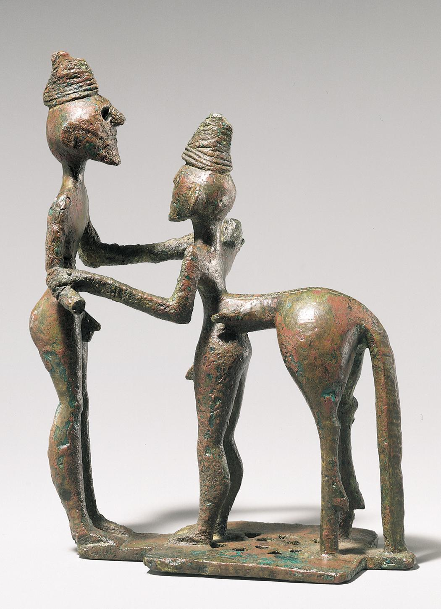

## 基本信息
- 作者：匿名
- 创作年代：约公元前 750—730 年
- 材质：青铜小型雕像（高度仅几厘米到十几厘米）
- 现存地：希腊国立考古博物馆 (*not from wiki*)

## 画面与技法
古希腊在引进 [[失蜡法 Lost-wax casting]] 之前的代表作之一：以木胎外裹青铜薄片再锤打制成，只能做几厘米到十几厘米高的体量。

## 历史背景 (*not from wiki*)
本课作为"埃及失蜡法传入希腊前后"体量跃升的典型对照示例：希腊本土早期工艺局限明显，转折发生在公元前 7 世纪希腊水手为埃及法老普萨美提克效力换得制作大型雕像的技术之后。

## 图片清单

| 编号 | 出自 | 描述 |
|---|---|---|
| 01 | [[002｜古希腊雕塑：为什么做得这么逼真？]] | 小型青铜雕像 |

<!-- src: https://piccdn3.umiwi.com/img/202103/10/202103101328374989122205.jpg -->

## 出现在
- [[002｜古希腊雕塑：为什么做得这么逼真？]]
