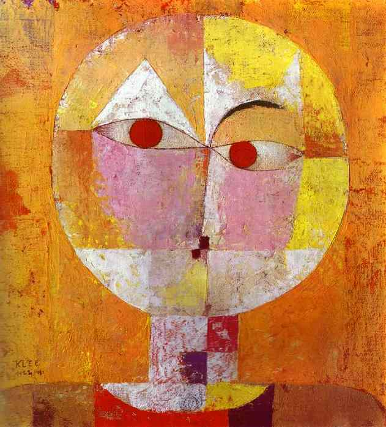

## 基本信息

- 作者：[[克利 Paul Klee]]
- 创作年代：1922
- 材质：水彩 (*not from wiki*)
- 现存地：(*not from wiki*)

## 画面与技法

[[克利 Paul Klee]] 1922 年作。本讲举为他"运用想象、动用直觉，去再造一个婴儿眼中的世界"的代表作。配合克利的关键句：

> 艺术不是模仿可见的事物，而是制造可见的事物。

——这里的"可见"，指的是**婴儿所见**。

## 历史背景

(*not from wiki*) 创作于克利在魏玛 [[包豪斯 Bauhaus]] 任教期间。

## 图片清单

| 编号 | 出自 | 描述 |
|---|---|---|
| 01 | [[085｜克利：他为什么模仿小孩子画画？]] | 童稚笔触描绘老人面容 |

## 出现在

- [[085｜克利：他为什么模仿小孩子画画？]]
