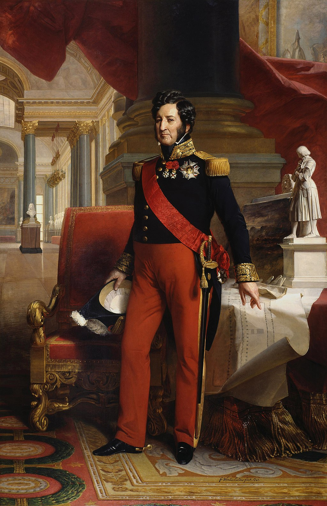

## 基本信息

- 作者：[[温特哈特 Franz Xaver Winterhalter]]
- 创作年代：1839
- 材质：布面油画 (*not from wiki*)
- 现存地：凡尔赛宫国家博物馆 Musée national des châteaux de Versailles et de Trianon (*not from wiki*)

## 画面与技法

与莱弗尔的 [[路易十八像 Portrait of Louis XVIII of France]]、杰拉德的 [[查理十世像 Portrait of Charles X of France]] 形成**强烈反差**——路易·菲利普不再穿加冕长袍，不再佩百合花纹大氅，**穿现代军装制服**（蓝色法军元帅服 + 大十字勋章绶带），手持军刀，背景换成法国国旗与三色绶带。视觉编码从"君权神授太阳王"一夜之间切换到"**全民拥戴的资产阶级国王**"。(*not from wiki*)

## 历史背景

(*not from wiki*) 路易·菲利普（1773–1850）是奥尔良公爵腓力·平等的儿子，七月革命后被推上王位，称号不是"法国国王"(roi de France) 而是"**法兰西人的国王**"(roi des Français)——一字之差，宣告君主合法性来源从天命变成人民。1830–1848 七月王朝期间他**把实权交给议会，自称资产阶级国王**——顾衡 031 描述："天天拄着把雨伞在街上看见人就握手，岁月静好云卷云舒的，对煞有介事的新古典主义当然就不感冒。"

本作在 031 中的功能：与议会里"事事模仿贵族 → 洛可可巴洛克回归宫廷"的暴发户审美一起，论证**七月王朝的官方品味也不与坚守新古典主义的学院派站一队**——德拉克罗瓦六次申请法兰西学院院士均被拒，但王室订单源源不断送到他手上。

## 图片清单

| 编号 | 出自 | 描述 |
|---|---|---|
| 01 | [[031｜学院派为什么迅速没落？]] | 军装半身像 |

## 出现在

- [[031｜学院派为什么迅速没落？]]
