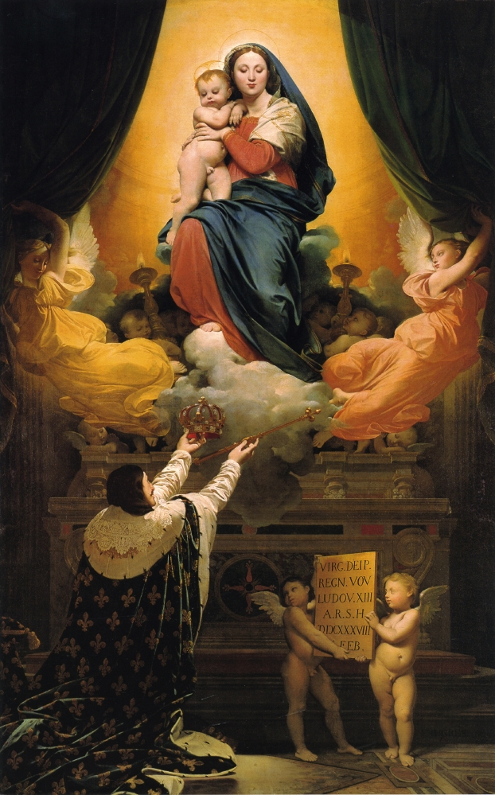

## 基本信息

- 作者：[[安格尔 Jean-Auguste-Dominique Ingres]]
- 创作年代：1824
- 材质：布面油画 (*not from wiki*)
- 尺寸：421 × 262 cm (*not from wiki*)
- 现存地：(*not from wiki*) 法国蒙托邦圣母升天主教座堂 (Cathédrale Notre-Dame de l'Assomption, Montauban) —— 安格尔故乡

## 画面与技法

**双层构图** —— 上层圣母怀抱圣婴 (圣家族母子像传统)、下层路易十三跪奉皇冠与宝剑于圣母——题材：1638 年路易十三在生子前向圣母许愿、将法国奉献给圣母玛利亚。

构图**严格对称、人物庄重**——直接致敬 [[拉斐尔 Raphael]] 的圣母系列。是安格尔**对拉斐尔母题的成熟应用**——又是其**对波旁王朝的政治效忠之作**。

## 历史背景

> 顾衡 032："1824 年，安格尔回到了法国。在意大利呆了 20 年，老师大卫又早就失势了，所以安格尔在法国美术界一直就是个边缘人物。但是他回去之后画了这幅《路易十三的誓愿》，**向复辟的波旁王朝效忠**。"

**1815 年滑铁卢战役**后波旁王朝复辟、路易十八继位；1824 年路易十八去世、查理十世继位——查理十世重视宗教与王权象征。本作于 1824 年沙龙展出，**获得巨大成功**：

> "这幅画给他带来了丰厚的回报。**第二年，他就当选法兰西学院院士**，成为法兰西美术学院的领军人物。"

但安格尔的领军人物当得"很不自在"——因为**新古典主义在大革命后的法国两头受气**（政府不认同 + 浪漫主义文坛攻击）。这一矛盾推动他后续转向"**[[政治与艺术防火墙 The Wall between Politics and Art]]**"策略。

本作落入故乡蒙托邦主教座堂——既是安格尔献给故乡的礼物，也是其"政治效忠"的物质化体现。

## 图片清单

| 编号 | 出自 | 描述 |
|---|---|---|
| 01 | [[032｜安格尔：为什么他是学院派最后一位大师？]] | 整体画面 |

## 出现在

- [[032｜安格尔：为什么他是学院派最后一位大师？]]
