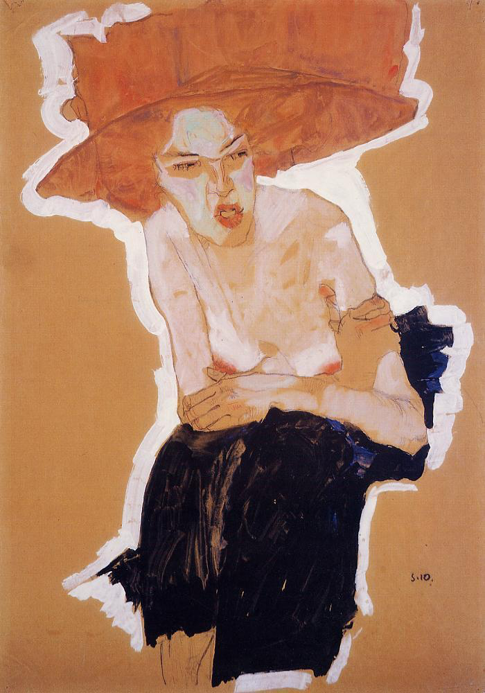

## 基本信息

- 作者：[[席勒 Egon Schiele]]
- 创作年代：1910
- 材质：（*not from wiki*）纸本 / 水彩 + 铅笔
- 尺寸：（*not from wiki*）暂缺
- 现存地：（*not from wiki*）暂缺

模特：席勒妹妹 [[格蒂·席勒 Gerti Schiele]]。

## 画面与技法

顾衡 074：席勒"给格蒂画了很多裸体画，这幅《轻蔑的女人》，已经算是**尺度最小的了**"——以此作为席勒早期家庭张力 / 兄妹亲昵母题的一个**保守入口**。

副标题 "轻蔑的女人（格蒂）" 中的"轻蔑"在席勒的人物画语境里通常指向**对外部凝视的拒绝**——配合席勒 1910 起人物画的"焦虑紧张"路线（参考 [[神经官能症 Neurosis]] 的焦虑 / 恐惧分类）。

## 历史背景 (*not from wiki*)

- 席勒 1910 年集中创作以妹妹格蒂为模特的肖像 / 裸体；这一年也是席勒"故意画残缺"母题的转折年（同年有《[[自画像 (席勒 1910) Self Portrait (Schiele)]]》《[[赤裸的自画像 (席勒 1910) Self Portrait Nude (Schiele)]]》）

## 图片清单

| 编号 | 出自 | 描述 |
|---|---|---|
| 01 | [[074｜席勒1：他为什么走向表现主义？]] | 全图 |

## 出现在

- [[074｜席勒1：他为什么走向表现主义？]]
