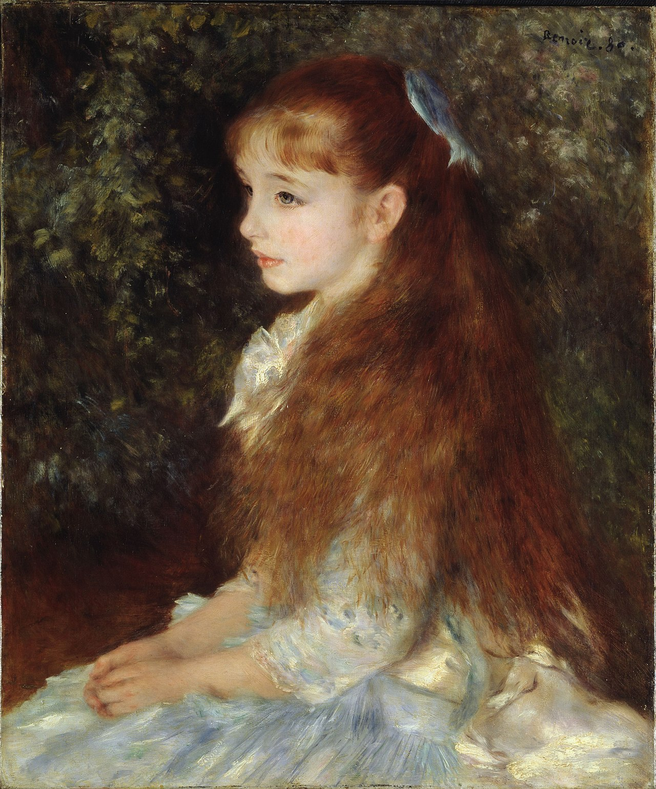

## 基本信息

- 作者：[[雷诺阿 Pierre-Auguste Renoir]]
- 创作年代：1880
- 材质：布面油画 (*not from wiki*)
- 尺寸：65 × 54 cm (*not from wiki*)
- 现存地：比尔勒基金会 Foundation E.G. Bührle, Zurich (*not from wiki*)

## 画面与技法

043 顾衡复述：**"这幅画实在太漂亮了。人物的面庞采用的是传统的画法，而衣物和背景的树叶，则采用了印象派的画法。这个折衷的办法，立即让雷诺阿大受欢迎。"**

继《[[夏庞蒂埃夫人和她的孩子们 Madame Charpentier and her children]]》后，雷诺阿"两头不得罪"调和公式的标准化产物——题主是 8 岁的银行家达威尔（卡昂·当费尔家族）千金，一头红发披散在绿叶背景前，是 19 世纪末欧洲布尔乔亚肖像画的代表。

## 历史背景 (*not from wiki*)

题主伊雷娜·卡昂·当费尔 (Irène Cahen d'Anvers, 1872–1963) 是巴黎犹太银行家家族成员。本画后来流转曲折——1941 年被纳粹劫掠，二战后归还家族，1949 年被收藏家比尔勒购入，现存苏黎世。

## 图片清单

| 编号 | 出自 | 描述 |
|---|---|---|
| 01 | [[043｜雷诺阿：妥协如何造就大师？]] | 全图，红发小女孩半身像 |

## 出现在

- [[043｜雷诺阿：妥协如何造就大师？]]
